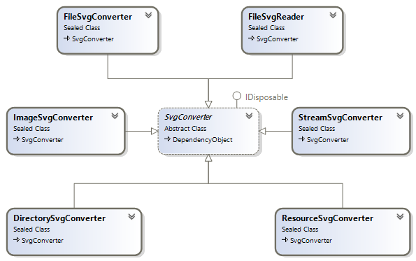
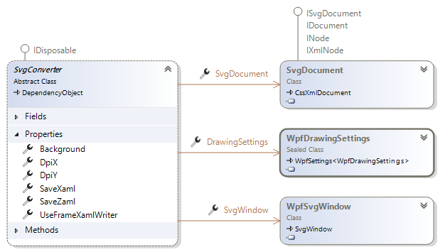

# SVG Converters

The SVG to WPF conversion is currently the main use case of this SharpVectors library. Other uses will be improved over time.
The following diagram shows all the available converters.

* **[FileSvgConverter](xref:SharpVectors.Converters.FileSvgConverter)**: Converts the SVG file to the corresponding XAML file, which can be viewed in a WPF application. The root object in the converted file is [DrawingGroup](xref:System.Windows.Media.DrawingGroup).
* **[FileSvgReader](xref:SharpVectors.Converters.FileSvgReader)**: Converts the SVG file to [DrawingGroup](xref:System.Windows.Media.DrawingGroup) and can optionally save the result to a file as XAML.
* **[ImageSvgConverter](xref:SharpVectors.Converters.ImageSvgConverter)**: Converts the SVG file to a static or bitmap image, which can be saved to a file.
* **[StreamSvgConverter](xref:SharpVectors.Converters.StreamSvgConverter)**: Converts the SVG file or stream to a static or bitmap image, which can be saved to a stream. This can be used for ASP.NET pages.
* **[DirectorySvgConverter](xref:SharpVectors.Converters.DirectorySvgConverter)**: Converts a directory (and optionally the sub-directories) of SVG files to XAML files in a specified directory, maintaining the original directory structure.
* **[ResourceSvgConverter](xref:SharpVectors.Converters.ResourceSvgConverter)**: Converts multiple directories (excluding sub-directories) of SVG files to a [DrawingGroup](xref:System.Windows.ResourceDictionary) XAML.
* **[SvgToBitmapValueConverter](xref:topic_svg_to_bitmap_converter)**: A WPF value converter that rasterizes SVG files to [BitmapImage](xref:System.Windows.Media.Imaging.BitmapImage) for data binding scenarios.

The **[SvgConverter](xref:SharpVectors.Converters.SvgConverter)** class is the base class for these converters and defines the following common properties:

* **DrawingSettings**: The rendering options class, [WpfDrawingSettings](xref:SharpVectors.Renderers.Wpf.WpfDrawingSettings).
* **SaveXaml**: Determines whether to save conversion output to XAML format.
* **SaveZaml**: Determines whether to save conversion output to ZAML format, which is a Gzip compression of XAML format, similar to SVGZ (for SVG).
* **UseFrameXamlWriter**: Determines whether to use the .NET Framework version of the XAML writer when saving the output to XAML format. The default is **false**, and a customized XAML writer is used.
