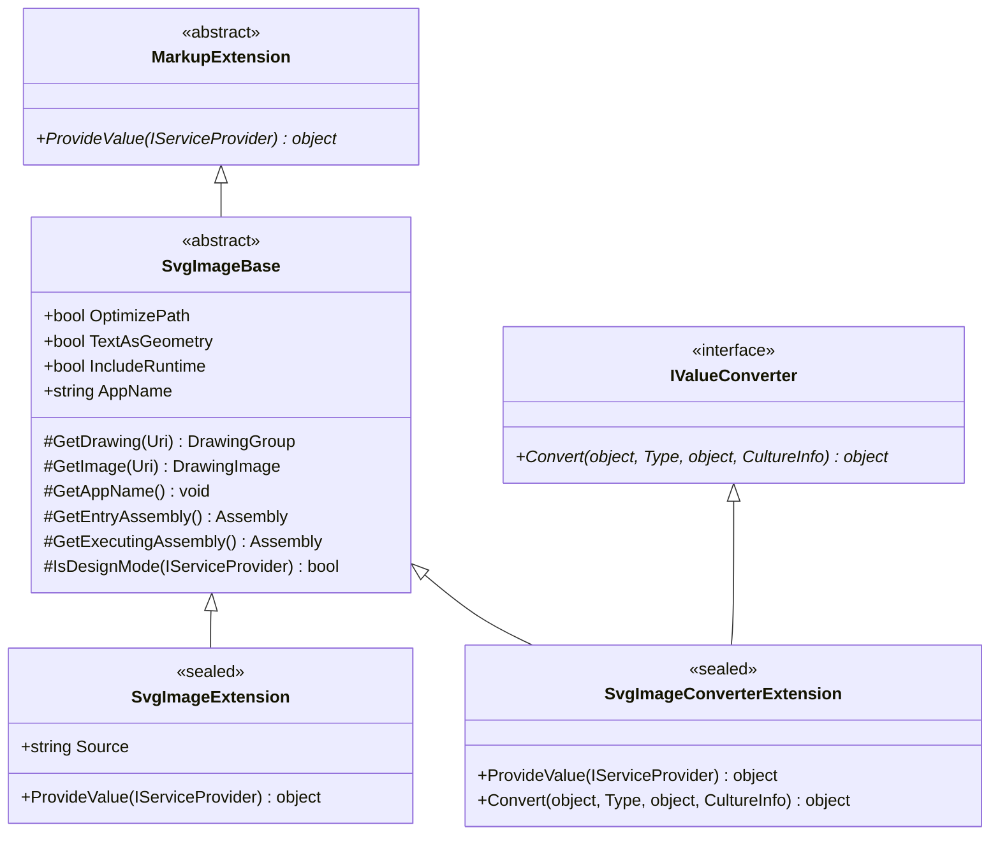
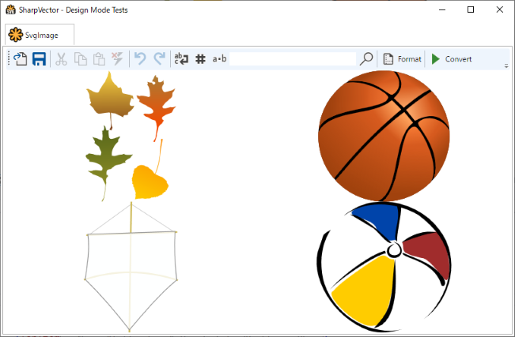
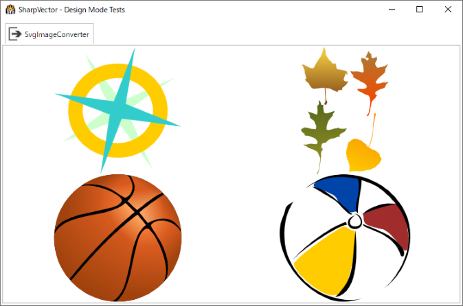

# SVG Markup Extensions

These are WPF markup extensions or type converters for handling the SVG files in WPF applications.
Currently, SharpVectors provides two markup extensions, [SvgImageExtension](xref:SharpVectors.Converters.SvgImageExtension) and [SvgImageConverterExtension](xref:SharpVectors.Converters.SvgImageConverterExtension), which convert an SVG source document to a [DrawingImage](xref:System.Windows.Media.DrawingImage).

These classes derived from [SvgImageBase](xref:SharpVectors.Converters.SvgImageBase) class, which extents the WPF markup extension base class [MarkupExtension](xref:System.Windows.Markup.MarkupExtension) as shown below.

Markup extensions in WPF are not dependency objects, and cannot support data binding. The [SvgImageConverterExtension](xref:SharpVectors.Converters.SvgImageConverterExtension) class implements the [IValueConverter](xref:System.Windows.Data.IValueConverter) interface to enable data binding supports on the markup extension. Use this where data binding is required or the [SVG Image Controls](xref:topic_image_controls) ([SvgBitmap](xref:SharpVectors.Converters.SvgBitmap), [SvgIcon](xref:SharpVectors.Converters.SvgIcon)), which also provide static images.



* As shown in the diagram above of the [SvgImageBase](xref:SharpVectors.Converters.SvgImageBase) class, the relevant rendering settings or options are available on these markup extensions as properties.
* The additional property, **SvgImageBase.AppName**, is used to specify the name of the source assembly in cases where the SVG document is a resource in a .NET assembly. This provides a hint to the system when resolving the URI to the resource file, especially in the design-mode.
* The main property here is the **SvgImageExtension.Source**, which is the path to the SVG file, and the file itself can be located in the following:
  * **Web/Internet**: The path in this case is the HTTP, FTP, etc scheme URI of the file.
  * **Local Computer Disk**: The path is the absolute or the relative URI to the SVG file.
  * **Resources**: The path is the [Microsoft Pack URI](https://docs.microsoft.com/en-us/dotnet/framework/wpf/app-development/pack-uris-in-wpf) of the SVG resource file.

> [!NOTE]
> The **SVG Markup Extensions** are lightweight objects, and unlike the **SVG Image Controls**, these are not WPF controls. However, if the target use is within image control, then the SVG image controls are preferred.

## SvgImageExtension Markup Extension

This is the basic SVG markup extension to provide SVG static images, and as stated above does not support data binding. The source codes of the **WpfTestResourceSvg** sample is used for illustration.

The XAML source is shown below: SVG resource files are also used as toolbar images.

```xml
<Window x:Class="WpfTestResourceSvg.MainWindow"
        xmlns="http://schemas.microsoft.com/winfx/2006/xaml/presentation"
        xmlns:x="http://schemas.microsoft.com/winfx/2006/xaml"
        xmlns:d="http://schemas.microsoft.com/expression/blend/2008"
        xmlns:mc="http://schemas.openxmlformats.org/markup-compatibility/2006"
        xmlns:svgc="http://sharpvectors.codeplex.com/svgc/"
        xmlns:local="clr-namespace:WpfTestResourceSvg"
        mc:Ignorable="d"
        Title="SharpVector - Design Mode Tests" Height="720" Width="960" Icon="App.ico" WindowStartupLocation="CenterScreen">
    <DockPanel LastChildFill="True" Margin="3">
        <TabControl>
            <TabItem x:Name="tabSvgImage">
                <TabItem.Header>
                    <StackPanel Orientation="Horizontal">
                        <Image Height="24px" Width="24px" Source="{svgc:SvgImage Source=/Images/SvgLogoBasic.svg, AppName=WpfTestResourceSvg}" />
                        <TextBlock Text="SvgImage" Margin="3" VerticalAlignment="Center" MinWidth="70"/>
                    </StackPanel>
                </TabItem.Header>
                <DockPanel LastChildFill="True">
                    <ToolBar DockPanel.Dock="Top" Height="36">
                        <ToolBar.Resources>
                            <Style TargetType="{x:Type Image}">
                                <Style.Triggers>
                                    <DataTrigger Binding="{Binding RelativeSource={RelativeSource AncestorType={x:Type ButtonBase}, AncestorLevel=1}, Path=IsEnabled}" Value="False">
                                        <Setter Property="Opacity" Value="0.30" />
                                    </DataTrigger>
                                </Style.Triggers>
                            </Style>
                        </ToolBar.Resources>
                        <Button>
                            <Image Source="{svgc:SvgImage Source=/Images/Open.svg, AppName=WpfTestResourceSvg}" Height="24" Width="24"/>
                        </Button>
                        <Button>
                            <Image Source="{svgc:SvgImage Source=/Images/Save.svg, AppName=WpfTestResourceSvg}" Height="24" Width="24"/>
                        </Button>
                        <Separator/>
                        <Button Command="Cut" ToolTip="Cut To Clipboard">
                            <Image Source="{svgc:SvgImage Source=/Images/Cut.svg, AppName=WpfTestResourceSvg}" Height="24" Width="24"/>
                        </Button>
                        <Button Command="Copy" ToolTip="Copy To Clipboard">
                            <Image Source="{svgc:SvgImage Source=/Images/Copy.svg, AppName=WpfTestResourceSvg}" Height="24" Width="24"/>
                        </Button>
                        <Button Command="Paste" ToolTip="Paste From Clipboard">
                            <Image Source="{svgc:SvgImage Source=/Images/Paste.svg, AppName=WpfTestResourceSvg}" Height="24" Width="24"/>
                        </Button>
                        <Button Command="Delete" ToolTip="Delete Selection">
                            <Image Source="{svgc:SvgImage Source=/Images/Delete.svg, AppName=WpfTestResourceSvg}" Height="24" Width="24"/>
                        </Button>
                        <Separator/>
                        <Button Command="Undo" ToolTip="Undo">
                            <Image Source="{svgc:SvgImage Source=/Images/Undo.svg, AppName=WpfTestResourceSvg}" Height="24" Width="24"/>
                        </Button>
                        <Button Command="Redo" ToolTip="Redo">
                            <Image Source="{svgc:SvgImage Source=/Images/Redo.svg, AppName=WpfTestResourceSvg}" Height="24" Width="24"/>
                        </Button>
                        <Separator/>
                        <CheckBox IsChecked="{Binding ElementName=textEditor,Path=WordWrap}" ToolTip="Word Wrap">
                            <Image Source="{svgc:SvgImage Source=/Images/WordWrap.svg, AppName=WpfTestResourceSvg}" Height="24" Width="24"/>
                        </CheckBox>
                        <CheckBox IsChecked="{Binding ElementName=textEditor,Path=ShowLineNumbers}" ToolTip="Show Line Numbers">
                            <Image Source="{svgc:SvgImage Source=/Images/Number.svg, AppName=WpfTestResourceSvg}" Height="24" Width="24"/>
                        </CheckBox>
                        <CheckBox IsChecked="{Binding ElementName=textEditor,Path=Options.ShowEndOfLine}" ToolTip="Show End Of Line">
                            <Image Source="{svgc:SvgImage Source=/Images/Space.svg, AppName=WpfTestResourceSvg}" Height="24" Width="24"/>
                        </CheckBox>
                        <TextBox x:Name="searchTextBox" Width="200" />
                        <Button>
                            <Image Source="{svgc:SvgImage Source=/Images/Find.svg, AppName=WpfTestResourceSvg}" Height="24" Width="24"/>
                        </Button>
                        <Separator/>
                        <Button x:Name="formatInput" ToolTip="Format Document">
                            <StackPanel Orientation="Horizontal">
                                <Image Source="{svgc:SvgImage Source=/Images/Format.svg, AppName=WpfTestResourceSvg}" Height="24" Width="24"/>
                                <TextBlock Margin="3,0,0,0" VerticalAlignment="Center">Format</TextBlock>
                            </StackPanel>
                        </Button>
                        <Separator/>
                        <Button x:Name="convertInput" ToolTip="Convert Document">
                            <StackPanel Orientation="Horizontal">
                                <Image Source="{svgc:SvgImage Source=/Images/Run.svg, AppName=WpfTestResourceSvg}" Height="24" Width="24"/>
                                <TextBlock Margin="3,0,0,0" VerticalAlignment="Center">Convert</TextBlock>
                            </StackPanel>
                        </Button>
                    </ToolBar>
                
                    <UniformGrid Rows="2" Columns="2">
                        <Image Source="{svgc:SvgImage Source=/Resources/autum_leaf.svg, AppName=WpfTestResourceSvg}" Stretch="Uniform"/>
                        <Image Source="{svgc:SvgImage Source=/Resources/basket.svg, AppName=WpfTestResourceSvg}" Stretch="Uniform"/>
                        <Image Source="{svgc:SvgImage Source=/Resources/kite.svg, AppName=WpfTestResourceSvg}" Stretch="Uniform"/>
                        <Image Source="{svgc:SvgImage Source=/Resources/beach_ball.svg, AppName=WpfTestResourceSvg}" Stretch="Uniform"/>
                    </UniformGrid>

                </DockPanel>
            </TabItem>
        </TabControl>
    </DockPanel>
</Window>
```

The following image shows the result of the above uses of the **SvgImageExtension** class:



> [!NOTE]
> For more extensive illustration of the **SvgImageExtension** class in both C# and VB.NET, see the **SvgImageSample** and **SvgImageSampleVB** samples in the [TutorialSamples/ControlSamplesWpf](https://github.com/ElinamLLC/SharpVectors/tree/master/TutorialSamples/ControlSamplesWpf) directory.

## SvgImageConverterExtension Markup Extension

This is an extended implementation of the SVG markup extension to support data binding through the converter interface. As above, the source codes of the **WpfTestResourceSvg** sample is used for illustration.

The XAML source is shown below:

```xml
<Window x:Class="WpfTestResourceSvg.MainWindow"
        xmlns="http://schemas.microsoft.com/winfx/2006/xaml/presentation"
        xmlns:x="http://schemas.microsoft.com/winfx/2006/xaml"
        xmlns:d="http://schemas.microsoft.com/expression/blend/2008"
        xmlns:mc="http://schemas.openxmlformats.org/markup-compatibility/2006"
        xmlns:svgc="http://sharpvectors.codeplex.com/svgc/"
        xmlns:local="clr-namespace:WpfTestResourceSvg"
        mc:Ignorable="d"
        Title="SharpVector - Design Mode Tests" Height="720" Width="960" Icon="App.ico" WindowStartupLocation="CenterScreen">
    <DockPanel LastChildFill="True" Margin="3">
        <TabControl>
            <TabItem x:Name="tabSvgImageConverter">
                <TabItem.Header>
                    <StackPanel Orientation="Horizontal">
                        <Image Height="24px" Width="24px" Source="{svgc:SvgImage Source=/Images/Output.svg, AppName=WpfTestResourceSvg}" />
                        <TextBlock Text="SvgImageConverter" Margin="3" VerticalAlignment="Center" MinWidth="70"/>
                    </StackPanel>
                </TabItem.Header>
                <UniformGrid Rows="2" Columns="2">
                    <Image Source="{Binding Converter={svgc:SvgImageConverter}, ConverterParameter=https://dev.w3.org/SVG/tools/svgweb/samples/svg-files/compass.svg, Mode=OneWay}"/>
                    <Image Source="{Binding Converter={svgc:SvgImageConverter}, ConverterParameter=/Resources/autum_leaf.svg, Mode=OneWay}"/>
                    <Image Source="{Binding Converter={svgc:SvgImageConverter}, ConverterParameter=/Resources/basket.svg, Mode=OneWay}"/>
                    <Image Source="{Binding Converter={svgc:SvgImageConverter}, ConverterParameter=/Resources/beach_ball.svg, Mode=OneWay}"/>
                </UniformGrid>
            </TabItem>
        </TabControl>
    </DockPanel>
</Window>
```

The following image shows the result of the above uses of the **SvgImageConverterExtension** class:



> [!NOTE]
> For more extensive illustration of the **SvgImageConverterExtension** class in both C# and VB.NET, see the **SvgImageBindingSample** and **SvgImageBindingSampleVB** samples in the [TutorialSamples/ControlSamplesWpf](https://github.com/ElinamLLC/SharpVectors/tree/master/TutorialSamples/ControlSamplesWpf) directory.
