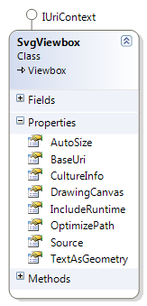
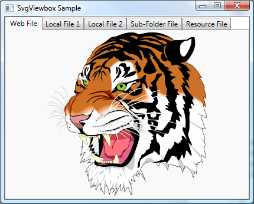
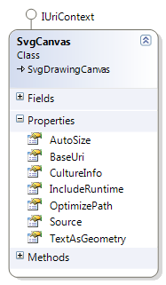
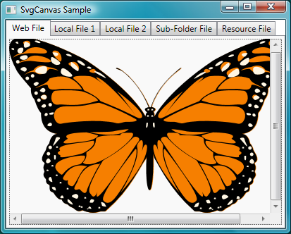

# SVG Controls
The SVG# Reloaded comes with one main end-user application, an SVG Viewer or Browser. The viewer is named Squiggle.NET or simply Squiggle, after a similar viewer in the [Batik SVG Toolkit](http://xmlgraphics.apache.org/batik/) (since the target is to produce something similar to the [Batik Squiggle](http://xmlgraphics.apache.org/batik/tools/browser.html)).


## Controls and Viewers
These are WPF controls for directly viewing the SVG files or sources in the WPF applications.

### 1.3.1 Viewbox Control - SvgViewbox
The **SvgViewbox** control is a WPF [Viewbox](https://docs.microsoft.com/en-us/dotnet/api/system.windows.controls.viewbox) derived control for viewing the SVG files in WPF applications, and allowing you to use all the Viewbox decorator properties. 



* It wraps a drawing canvas instead of image, so will support interactivity when added to future release of the drawing canvas.
* The main property is the **SvgViewbox.Source**, which is an [System.Uri](https://docs.microsoft.com/en-us/dotnet/api/system.uri) specifying the path to the SVG file.

For the illustration, we will create the following WPF sample application:



1. Create a WPF application project, named **SvgViewboxSample**, similar to the steps in **Section 1.2**.
2. Modify the XAML of the main window to the following
	```xml
	<Window x:Class="SvgViewboxSample.MainWindow"
	    xmlns="http://schemas.microsoft.com/winfx/2006/xaml/presentation"
	    xmlns:x="http://schemas.microsoft.com/winfx/2006/xaml"
	    xmlns:svgc="http://sharpvectors.codeplex.com/svgc/"
	    Title="SvgViewbox Sample" Height="346" Width="430" Background="White">
	    <DockPanel>
		<TabControl SelectedIndex="0" OverridesDefaultStyle="False">
		    <TabItem>
			<TabItem.Header>Web File</TabItem.Header>
			<TabItem.Content>
			    <!-- 1. Load Web SVG file -->
			    <svgc:SvgViewbox Source=
		    "http://croczilla.com/bits_and_pieces/svg/samples/tiger/tiger.svg"/>
			</TabItem.Content>
		    </TabItem>
		    <TabItem>
			<TabItem.Header>Local File 1</TabItem.Header>
			<TabItem.Content>
			    <!-- 2. Load local SVG file -->
			    <svgc:SvgViewbox Source="../Test1.svg"/>
			</TabItem.Content>
		    </TabItem>
		    <TabItem>
			<TabItem.Header>Local File 2</TabItem.Header>
			<TabItem.Content>
			    <!-- 3. Load local SVG file -->
			    <svgc:SvgViewbox Source="Test2.svg" TextAsGeometry="True"/>
			</TabItem.Content>
		    </TabItem>
		    <TabItem>
			<TabItem.Header>Sub-Folder File</TabItem.Header>
			<TabItem.Content>
			    <!-- 4. Load local sub-folder SVG file  -->
			    <svgc:SvgViewbox Source="\SubFolder\Test3.svg"/>
			</TabItem.Content>
		    </TabItem>
		    <TabItem>
			<TabItem.Header>Resource File</TabItem.Header>
			<TabItem.Content>
			    <!-- 5. Load Resource SVG file -->
			    <svgc:SvgViewbox Source="/Resources/Test.svg" Stretch="Uniform"/>
			</TabItem.Content>
		    </TabItem>
		</TabControl>
	    </DockPanel>
	</Window>
	```
3. Compile and run the program.

### 1.3.2 Canvas Control - SvgCanvas
The **SvgCanvas** control is a WPF [Canvas](https://docs.microsoft.com/en-us/dotnet/api/system.windows.controls.canvas) derived control for viewing the SVG files in WPF applications, and allowing you to use all the canvas properties. 



* It derives from a drawing canvas instead of the generic canvas control, so will support interactivity when added to future release of the drawing canvas.
* The main property is the **SvgCanvas.Source**, which is an [System.Uri](https://docs.microsoft.com/en-us/dotnet/api/system.uri) specifying the path to the SVG file.

For the illustration, we will create the following WPF sample application:



1. Create a WPF application project, named **SvgCanvasSample**, similar to the steps in **Section 1.2**.
2. Modify the XAML of the main window to the following
	```xml
	<Window x:Class="SvgCanvasSample.MainWindow"
	    xmlns="http://schemas.microsoft.com/winfx/2006/xaml/presentation"
	    xmlns:x="http://schemas.microsoft.com/winfx/2006/xaml"
	    xmlns:svgc="http://sharpvectors.codeplex.com/svgc/"
	    Title="SvgCanvas Sample" Height="332" Width="413" Background="White">
	    <DockPanel>
		<TabControl SelectedIndex="0" OverridesDefaultStyle="False">
		    <TabItem>
			<TabItem.Header>Web File</TabItem.Header>
			<TabItem.Content>
			    <ScrollViewer CanContentScroll="False" 
			       VerticalScrollBarVisibility="Auto" 
			       HorizontalScrollBarVisibility="Auto">                        
				<!-- 1. Load Web SVG file -->
				<svgc:SvgCanvas Source=
		   "http://croczilla.com/bits_and_pieces/svg/samples/butterfly/butterfly.svg"/>
			    </ScrollViewer>
			</TabItem.Content>
		    </TabItem>
		    <TabItem>
			<TabItem.Header>Local File 1</TabItem.Header>
			<TabItem.Content>
			    <ScrollViewer CanContentScroll="False" 
			       VerticalScrollBarVisibility="Auto" 
			       HorizontalScrollBarVisibility="Auto">                        
				<!-- 2. Load local SVG file -->
				<svgc:SvgCanvas Source="../Test1.svg"/>
			    </ScrollViewer>
			</TabItem.Content>
		    </TabItem>
		    <TabItem>
			<TabItem.Header>Local File 2</TabItem.Header>
			<TabItem.Content>
			    <ScrollViewer CanContentScroll="False" 
			       VerticalScrollBarVisibility="Auto" 
			       HorizontalScrollBarVisibility="Auto">
				<!-- 3. Load local SVG file -->
				<svgc:SvgCanvas Source="Test2.svg"/>
			    </ScrollViewer>
			</TabItem.Content>
		    </TabItem>
		    <TabItem>
			<TabItem.Header>Sub-Folder File</TabItem.Header>
			<TabItem.Content>
			    <ScrollViewer CanContentScroll="False" 
			       VerticalScrollBarVisibility="Auto" 
			       HorizontalScrollBarVisibility="Auto">
				<!-- 4. Load local sub-folder SVG file  -->
				<svgc:SvgCanvas Source="\SubFolder\Test3.svg"/>
			    </ScrollViewer>
			</TabItem.Content>
		    </TabItem>
		    <TabItem>
			<TabItem.Header>Resource File</TabItem.Header>
			<TabItem.Content>
			    <ScrollViewer CanContentScroll="False" 
			       VerticalScrollBarVisibility="Auto" 
			       HorizontalScrollBarVisibility="Auto">
				<!-- 5. Load Resource SVG file -->
				<svgc:SvgCanvas Source="/Resources/Test.svg"/>
			    </ScrollViewer>
			</TabItem.Content>
		    </TabItem>
		</TabControl>
	    </DockPanel>
	</Window>
	```
3. Compile and run the program.

## Sample Codes
Download the sample codes from the **TutorialSamples Folder** tab.

