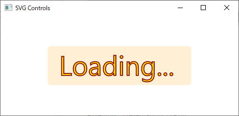
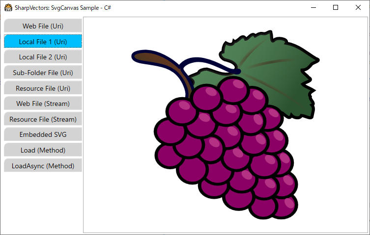

# SVG Controls
These are WPF controls for directly viewing the SVG documents in the WPF applications. The class diagrams are shown below:


## Common Drawing Control - SvgDrawingCanvas

The [SvgDrawingCanvas](xref:SharpVectors.Runtime.SvgDrawingCanvas) control is a generic canvas that extends the WPF [Canvas](xref:System.Windows.Controls.Canvas) control to provide rendering of drawing objects or [DrawingGroup](xref:System.Windows.Media.DrawingGroup) created from SVG documents.

* The **SvgDrawingCanvas** is specilized for rendering drawings generated by the SharpVectors, and therefore will not be useful for rendering other WPF drawings.
The [SvgDrawingCanvas.RenderDiagrams](xref:SharpVectors.Runtime.SvgDrawingCanvas.RenderDiagrams(System.Windows.Media.DrawingGroup)) methods takes the WPF drawing generated from the conversion of the SVG documents and render it for viewing.
* The **SvgDrawingCanvas** itself does not handle the processing or conversion of the SVG documents to the WPF drawings. This is generic so that the serialized XAML format of the generated drawings can also be reloaded or deserialized and rendered by the **SvgDrawingCanvas** class.
The [SvgDrawingCanvas.LoadDiagrams](xref:SharpVectors.Runtime.SvgDrawingCanvas.LoadDiagrams(System.String)) method takes the serialized XAML file, deserialized it to the corresponding WPF drawing and renders it.
* The [SvgCanvas](xref:SharpVectors.Converters.SvgCanvas) and [SvgViewbox](xref:SharpVectors.Converters.SvgViewbox) controls extends and embeds **SvgDrawingCanvas** respectively. These controls handle the conversion of the SVG documents to WPF drawings and uses the **SvgDrawingCanvas** to render.
* Controls deriving from the **SvgDrawingCanvas** class instead of the WPF canvas control will support interactivity when added to future release of the drawing canvas.

## Common Drawing Properties

The SVG drawing controls either extending or embedding as child the [SvgDrawingCanvas](xref:SharpVectors.Runtime.SvgDrawingCanvas) control have similar properties.
In this section, we discuss these similar properties for simplification and avoid repeations.

### SVG Document Sources

These are the SVG document source properties of the SVG controls. The SVG controls provide three properties to be used as SVG document sources as explained below. These are WPF dependency properties and therefore supports data binding.

* **UriSource or Source** This property (type: [Uri](xref:System.Uri)) provides access to the SVG documents in the form of local files, assembly resource files ([Pack URIs](https://learn.microsoft.com/en-us/dotnet/desktop/wpf/app-development/pack-uris-in-wpf)) and remote files (supporting HTTP and HTTPS protocols, FTP protocol is not supported).
The **Source** property is the original name, and may be removed in the future.
* **StreamSource** This property (type: [Stream](xref:System.IO.Stream)) provides SVG documents through .NET stream object, which is a generic view of a sequence of bytes. The allows access to local documents, assembly resource documents, memory documents and network documents or basically any SVG document source to the .NET stream object instance is available.
    > [!NOTE]
    > The SVG controls take ownership of the stream since it is stored as dependency property. Therefore, a copy of the specified stream is created and kept in memory. If you do not desire a copy of the specified stream to be created, use the available load method that provides an option to skip the copy process.
* **SvgSource** This property (type: [String](xref:System.String)) provides the SVG documents as plain text. This is provided for cases where the SVG content is desired as part of the XAML content.

### SVG Settings or Options

The SVG controls convert SVG documents to WPF drawings and controls the settings or options ([WpfDrawingSettings](xref:SharpVectors.Renderers.Wpf.WpfDrawingSettings)) used by the conversion process. Therefore, the controls expose the conversion settings or options through properties for customization.
The current settings or options are shown below:

* [WpfDrawingSettings.OptimizePath](xref:SharpVectors.Renderers.Wpf.WpfDrawingSettings.OptimizePath) This property (type: [Boolean](xref:System.Boolean)) indicates whether the path geometry is optimized using [StreamGeometry](xref:System.Windows.Media.StreamGeometry).
* [WpfDrawingSettings.TextAsGeometry](xref:SharpVectors.Renderers.Wpf.WpfDrawingSettings.TextAsGeometry) This property (type: [Boolean](xref:System.Boolean)) indicates whether the text elements are rendered as path geometry.
* [WpfDrawingSettings.IncludeRuntime](xref:SharpVectors.Renderers.Wpf.WpfDrawingSettings.IncludeRuntime) This property (type: [Boolean](xref:System.Boolean)) indicates whether to include SharpVectors specific markup extensions in the generated WPF objects.
* [WpfDrawingSettings.IgnoreRootViewbox](xref:SharpVectors.Renderers.Wpf.WpfDrawingSettings.IgnoreRootViewbox) This property (type: [Boolean](xref:System.Boolean)) indicates whether to turn off viewbox at the root of the drawing.
* [WpfDrawingSettings.EnsureViewboxSize](xref:SharpVectors.Renderers.Wpf.WpfDrawingSettings.EnsureViewboxSize) This property (type: [Boolean](xref:System.Boolean)) indicates whether to preserve the original viewbox size when saving images.
* [WpfDrawingSettings.EnsureViewboxPosition](xref:SharpVectors.Renderers.Wpf.WpfDrawingSettings.EnsureViewboxPosition) This property (type: [Boolean](xref:System.Boolean)) indicates whether to apply a translate transform to the viewbox to ensure it is visible when rendered.

### SVG Progress Message Options

Loading and rendering a large SVG documents requires seconds to few minutes. The SVG controls provide a means to display a progress message to the user to indicate a long process in progress. The text of the progress message and its styling is controlled by the following properties:

* **MessageFontFamily** This property (type: [FontFamily](xref:System.Windows.Media.FontFamily)) specifies the font family used to render the progress message text. The default is `Loading...`.
* **MessageFontSize** This property (type: [Double](xref:System.Double)) specifies the size of the font used to render the progress message text.
* **MessageOpacity** This property (type: [Double](xref:System.Double)) specifies the opacity of the progress message.
* **MessageText** This property (type: [String](xref:System.String)) specifies the text of the progress message.
* **MessageBackground** This property (type: [Brush](xref:System.Windows.Media.Brush)) specifies the background brush of the progress message text.
* **MessageFillBrush** This property (type: [Brush](xref:System.Windows.Media.Brush)) specifies the fill of the progress message text.
* **MessageStrokeBrush** This property (type: [Brush](xref:System.Windows.Media.Brush)) specifies the stroke of the progress message text.

The default progress message text and styling are shown below:



## Canvas Control - SvgCanvas

The WPF [Canvas](xref:System.Windows.Controls.Canvas) defines an area within which you can explicitly position child elements by using coordinates that are relative to the [Canvas](xref:System.Windows.Controls.Canvas) area.
The [SvgCanvas](xref:SharpVectors.Converters.SvgCanvas) control is a WPF [Canvas](xref:System.Windows.Controls.Canvas) derived control for viewing the SVG files in WPF applications, and allowing you to use all the known features and behavior of the WPF canvas controls.
In particular, it extends the [SvgDrawingCanvas](xref:SharpVectors.Runtime.SvgDrawingCanvas) control and uses it to render any converted SVG drawing.

The following XAML codes from the **SvgCanvasSample** sample illustrates the uses of the **SvgCanvas** control.

```xml
<Window x:Class="SvgCanvasSample.MainWindow"
    xmlns="http://schemas.microsoft.com/winfx/2006/xaml/presentation"
    xmlns:x="http://schemas.microsoft.com/winfx/2006/xaml"
    xmlns:svgc="http://sharpvectors.codeplex.com/svgc/"
    Title="SharpVectors: SvgCanvas Sample - C#" Height="720" Width="960" 
        Background="White" WindowStartupLocation="CenterScreen" Icon="SvgCanvasSample.ico">
    <DockPanel Margin="3">
        <TabControl SelectedIndex="0" OverridesDefaultStyle="False" FontSize="14" TabStripPlacement="Left">
            <TabItem>
                <TabItem.Header>Web File (Uri)</TabItem.Header>
                <TabItem.Content>
                    <ScrollViewer CanContentScroll="False" Background="White" 
                           VerticalScrollBarVisibility="Auto" HorizontalScrollBarVisibility="Auto">
                        <!-- 1. Load Web SVG file -->
                        <svgc:SvgCanvas Source="https://dev.w3.org/SVG/tools/svgweb/samples/svg-files/rg1024_green_grapes.svg" 
                              HorizontalAlignment="Center" VerticalAlignment="Center"/>
                    </ScrollViewer>
                </TabItem.Content>
            </TabItem>
            <TabItem>
                <TabItem.Header>Local File 1 (Uri)</TabItem.Header>
                <TabItem.Content>
                    <ScrollViewer CanContentScroll="False" Background="White" 
                           VerticalScrollBarVisibility="Auto" HorizontalScrollBarVisibility="Auto">
                        <!-- 2. Load local SVG file -->
                        <svgc:SvgCanvas Source="../../Test1.svg" HorizontalAlignment="Center" VerticalAlignment="Center"/>
                    </ScrollViewer>
                </TabItem.Content>
            </TabItem>
            <TabItem>
                <TabItem.Header>Local File 2 (Uri)</TabItem.Header>
                <TabItem.Content>
                    <ScrollViewer CanContentScroll="False" Background="White" 
                           VerticalScrollBarVisibility="Auto" HorizontalScrollBarVisibility="Auto">
                        <!-- 3. Load local SVG file -->
                        <svgc:SvgCanvas Source="../Test2.svg" HorizontalAlignment="Center" VerticalAlignment="Center"/>
                    </ScrollViewer>
                </TabItem.Content>
            </TabItem>
            <TabItem>
                <TabItem.Header>Sub-Folder File (Uri)</TabItem.Header>
                <TabItem.Content>
                    <ScrollViewer CanContentScroll="False" Background="White" 
                           VerticalScrollBarVisibility="Auto" HorizontalScrollBarVisibility="Auto">
                        <!-- 4. Load local sub-folder SVG file  -->
                        <svgc:SvgCanvas Source="..\SubFolder\Test3.svg" HorizontalAlignment="Center" VerticalAlignment="Center"/>
                    </ScrollViewer>
                </TabItem.Content>
            </TabItem>
            <TabItem>
                <TabItem.Header>Resource File (Uri)</TabItem.Header>
                <TabItem.Content>
                    <ScrollViewer CanContentScroll="False" Background="White" 
                           VerticalScrollBarVisibility="Auto" HorizontalScrollBarVisibility="Auto">
                        <!-- 5. Load Resource SVG file -->
                        <svgc:SvgCanvas Source="/Resources/Test.svg" HorizontalAlignment="Center" VerticalAlignment="Center"/>
                    </ScrollViewer>
                </TabItem.Content>
            </TabItem>
            <TabItem>
                <TabItem.Header>Web File (Stream)</TabItem.Header>
                <TabItem.Content>
                    <ScrollViewer CanContentScroll="False" Background="White" 
                           VerticalScrollBarVisibility="Auto" HorizontalScrollBarVisibility="Auto">
                        <!-- 6. Load Web SVG file (Stream) -->
                        <svgc:SvgCanvas x:Name="webSvgCanvas" HorizontalAlignment="Center" VerticalAlignment="Center"/>
                    </ScrollViewer>
                </TabItem.Content>
            </TabItem>
            <TabItem>
                <TabItem.Header>Resource File (Stream)</TabItem.Header>
                <TabItem.Content>
                    <ScrollViewer CanContentScroll="False" Background="White" 
                           VerticalScrollBarVisibility="Auto" HorizontalScrollBarVisibility="Auto">
                        <!-- 7. Load Resource SVG file (Stream) -->
                        <svgc:SvgCanvas x:Name="resourceSvgCanvas" HorizontalAlignment="Center" VerticalAlignment="Center"/>
                    </ScrollViewer>
                </TabItem.Content>
            </TabItem>
            <TabItem>
                <TabItem.Header>Embedded SVG</TabItem.Header>
                <TabItem.Content>
                    <ScrollViewer CanContentScroll="False" Background="White" 
                           VerticalScrollBarVisibility="Auto" HorizontalScrollBarVisibility="Auto">
                        <!-- 8. Load local SVG file -->
                        <svgc:SvgCanvas HorizontalAlignment="Center" VerticalAlignment="Center">
                            <svgc:SvgCanvas.SvgSource>
                                <![CDATA[
<svg xmlns="http://www.w3.org/2000/svg" viewBox="0 0 100 100">
  <circle fill="#009" r="45" cx="50" cy="50"/>
  <path d="M33,26H78A37,37,0,0,1,33,83V57H59V43H33Z" fill="#FFF"/>
</svg>
                                ]]>
                            </svgc:SvgCanvas.SvgSource>
                        </svgc:SvgCanvas>
                    </ScrollViewer>
                </TabItem.Content>
            </TabItem>
        </TabControl>
    </DockPanel>
</Window>
```

The image of the  **SvgCanvasSample** sample is shown below:



## Viewbox Control - SvgViewbox

The  WPF [Viewbox](xref:System.Windows.Controls.Viewbox) control defines a content decorator that can stretch and scale a single child to fill the available space.
The **SvgViewbox** control is a WPF [Viewbox](xref:System.Windows.Controls.Viewbox) derived control for viewing the SVG files in WPF applications, and allowing you to use all the Viewbox decorator properties.

The single child control in the **SvgViewbox** control is an instance of the [SvgDrawingCanvas](xref:SharpVectors.Runtime.SvgDrawingCanvas) control, which it utitilizes to provide the rendering of the converted SVG documents.

The following XAML codes from the **SvgViewboxSample** sample illustrates the uses of the **SvgViewbox** control.

```xml
<Window x:Class="SvgViewboxSample.MainWindow"
    xmlns="http://schemas.microsoft.com/winfx/2006/xaml/presentation"
    xmlns:x="http://schemas.microsoft.com/winfx/2006/xaml"
    xmlns:svgc="http://sharpvectors.codeplex.com/svgc/"
    Title="SharpVectors: SvgViewbox Sample - C#"  Height="720" Width="960" 
        Background="White" Icon="SvgViewboxSample.ico" WindowStartupLocation="CenterScreen">
    <DockPanel Margin="3">
        <TabControl SelectedIndex="0" OverridesDefaultStyle="False" FontSize="14" TabStripPlacement="Left">
            <TabItem>
                <TabItem.Header>Web File (Uri)</TabItem.Header>
                <TabItem.Content>
                    <!-- 1. Load Web SVG file -->
                    <svgc:SvgViewbox Source="https://dev.w3.org/SVG/tools/svgweb/samples/svg-files/rg1024_green_grapes.svg"/>
                </TabItem.Content>
            </TabItem>
            <TabItem>
                <TabItem.Header>Local File 1 (Uri)</TabItem.Header>
                <TabItem.Content>
                    <!-- 2. Load local SVG file -->
                    <svgc:SvgViewbox Source="../../Test1.svg"/>
                </TabItem.Content>
            </TabItem>
            <TabItem>
                <TabItem.Header>Local File 2 (Uri)</TabItem.Header>
                <TabItem.Content>
                    <!-- 3. Load local SVG file -->
                    <svgc:SvgViewbox Source="../Test2.svg"/>
                </TabItem.Content>
            </TabItem>
            <TabItem>
                <TabItem.Header>Sub-Folder File (Uri)</TabItem.Header>
                <TabItem.Content>
                    <!-- 4. Load local sub-folder SVG file  -->
                    <svgc:SvgViewbox Source="..\SubFolder\Test3.svg"/>
                </TabItem.Content>
            </TabItem>
            <TabItem>
                <TabItem.Header>Resource File (Uri)</TabItem.Header>
                <TabItem.Content>
                    <!-- 5. Load Resource SVG file -->
                    <svgc:SvgViewbox Source="/Resources/Test.svg" Stretch="Uniform"/>
                </TabItem.Content>
            </TabItem>
            <TabItem>
                <TabItem.Header>Web File (Stream)</TabItem.Header>
                <TabItem.Content>
                    <!-- 6. Load Web SVG file (Stream) -->
                    <svgc:SvgViewbox x:Name="webSvgViewbox" HorizontalAlignment="Center" VerticalAlignment="Center"/>
                </TabItem.Content>
            </TabItem>
            <TabItem>
                <TabItem.Header>Resource File (Stream)</TabItem.Header>
                <TabItem.Content>
                    <!-- 7. Load Resource SVG file (Stream) -->
                    <svgc:SvgViewbox x:Name="resourceSvgViewbox" HorizontalAlignment="Center" VerticalAlignment="Center"/>
                </TabItem.Content>
            </TabItem>
            <TabItem>
                <TabItem.Header>Embedded SVG</TabItem.Header>
                <TabItem.Content>
                    <!-- 8. Load local SVG file -->
                    <svgc:SvgViewbox x:Name="embeddedSvgViewbox" HorizontalAlignment="Center" VerticalAlignment="Center">
                        <svgc:SvgViewbox.SvgSource>
                            <![CDATA[
<svg xmlns="http://www.w3.org/2000/svg" viewBox="0 0 100 100">
  <circle fill="#009" r="45" cx="50" cy="50"/>
  <path d="M33,26H78A37,37,0,0,1,33,83V57H59V43H33Z" fill="#FFF"/>
</svg>
                            ]]>
                        </svgc:SvgViewbox.SvgSource>
                    </svgc:SvgViewbox>
                </TabItem.Content>
            </TabItem>
        </TabControl>
    </DockPanel>
</Window>
```

The image of the  **SvgCanvasSample** sample is shown below:


