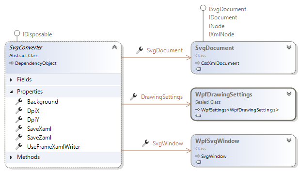

# SVG Converters
The SVG to WPF conversion is the main use of this SharpVectors library currently. The other uses will be improved with time.
The following is a diagram showing all the available converters.

* ****: This converts the SVG file to the corresponding XAML file, which can be viewed in WPF application. The root object in the converted file is [DrawingGroup](xref:System.Windows.Media.DrawingGroup).
* ****: This converts the SVG file to [DrawingGroup](xref:System.Windows.Media.DrawingGroup) and can optionally save the result to a file as XAML. 
* ****: This converts the SVG file to static or bitmap image, which can be saved to a file.
* ****: This converts the SVG file or stream to static or bitmap image, which can be saved to a stream. This can be used for ASP.NET pages.
* ****: This converts a directory (and optionally the sub-directories) of SVG files to XAML files in a specified directory, maintaining the original directory structure.
* ****: This converts multiple directories (without the sub-directories) of SVG files and SVG files a [DrawingGroup](xref:System.Windows.ResourceDictionary) XAML.

Now, as shown **** is the base class for the converters and defines the following common properties:

* **DrawingSettings**: This is the rendering options class, [WpfDrawingSettings](xref:SharpVectors.Renderers.Wpf.WpfDrawingSettings).
* **SaveXaml**: Determines whether to save conversion output to XAML format.
* **SaveZaml**: Determines whether to save conversion output to ZAML format, which is a G-zip compression of the XAML format, and similar to the SVGZ (for SVG).
* **UseFrameXamlWriter**: Determines whether the use the .NET Framework version of the XAML writer when saving the output to the XAML format. The default is **false**, and a customized XAML writer is used.
