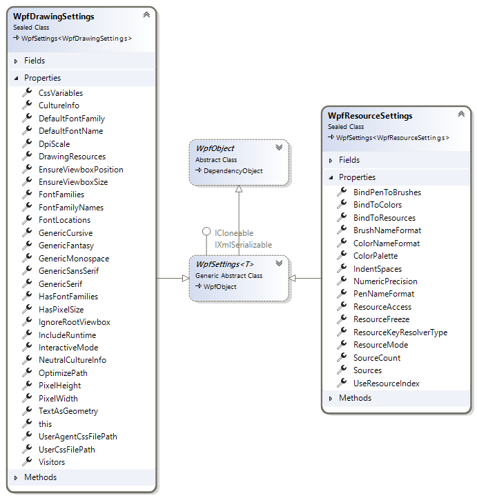

# Getting Started

The SharpVectors library provides three main uses of the SVG files in WPF applications. In this section, we will provide information to get you started with these uses.

For the WPF application, the rendering of the SVG files are provided through classes shown in the diagram below:


In some cases, the listed classes are entry points to the actual implementations as shown below for the text rendering.


For the GDI+ application, the rendering classes are shown in the diagram below:


## Options and Settings

A class **[](xref:SharpVectors.Renderers.Wpf.WpfDrawingSettings)** in the `SharpVectors.Rendering.Wpf` assembly provides the currently available user-defined options for the rendering. 
The other options class shown below is the **[](xref:SharpVectors.Renderers.Wpf.WpfResourceSettings)** class, [ResourceDictionary](xref:System.Windows.ResourceDictionary) specific output options that will be discussed later:



All the properties of this class are well documented. The most important properties are

* **CultureInfo**: This is the culture information used for the text rendering, and it is passed to the [FormattedText](xref:System.Windows.Media.FormattedText) class. The default is the English culture.
* **IncludeRuntime**: This determines whether the application using the output of the conversion will link to the SharpVectors.Runtime.dll. The default is **true**, set this to **false** if you do not intend to use the runtime assembly.
* **TextAsGeometry**: This determines whether the texts are rendered as path geometry. The default is **false**. The vertical text does not currently support this option. Set this to **true** if do not want to use the runtime assembly, so that font path will not be included in the output.

> [!NOTE]
> The **TextAsGeometry** property is marked as deprecated in this version, and will be removed in version 2.0 of the SharpVectors library.

## Rendering Process

For the WPF system, the rendering process is managed by various classes listed below: named

* **[](xref:SharpVectors.Renderers.Utils.WpfSvgWindow)**: An class implementing an abstraction of browser window object.
* **[](xref:SharpVectors.Renderers.Wpf.WpfDrawingRenderer)**: The controlling class used by the WPF implementation.
* **[](xref:SharpVectors.Renderers.Wpf.WpfDrawingDocument)**:: This is used to collect rendered drawing information such as a mapping of an SVG ID to the rendered drawing object,
* **[](xref:SharpVectors.Renderers.Wpf.WpfDrawingContext)**: The rendering context, which is not directly accessed by the user.

The following code illustrate the basic code required to render an SVG file to a WPF drawing object:

# [Rendering C# Sample](#tab/csharp)
```csharp
using System;

using System.Windows;
using System.Windows.Media;
using System.Windows.Media.Imaging;

using SharpVectors.Dom.Svg;
using SharpVectors.Renderers.Wpf;
using SharpVectors.Renderers.Utils;

namespace SharpVectors.Test.Sample
{
    public class TestRendering
    {
        // The drawing settings or options.
        private WpfDrawingSettings _wpfSettings;

        // The browser window object abstraction.
        private WpfSvgWindow _wpfWindow;

        // The main rendering controller.
        private WpfDrawingRenderer _wpfRenderer;

        public TestRendering()
        {
            // Initialize the options
            _wpfSettings = new WpfDrawingSettings();
            // Set the options to the rendering controller
            _wpfRenderer = new WpfDrawingRenderer(_wpfSettings);
            // Create a drawing area of 500x500 pixels and set the rending object to it.
            _wpfWindow   = new WpfSvgWindow(500, 500, _wpfRenderer);
        }

        public void Render(string svgFile)
        {
            // Create an instance of the rendered document
            var drawingDocument = new WpfDrawingDocument();

            // Signal the start of the rendering process, the drawing context is created.
            _wpfRenderer.BeginRender(drawingDocument);

            // Open the specified SVG file for drawin, the SVG DOM is created as SvgDocument
            _wpfWindow.LoadDocument(svgFile, _wpfSettings);

            // Get the created SVG document
            var svgDocument = _wpfWindow.Document as SvgDocument;

            // Render the SVG document
            _wpfRenderer.Render(svgDocument);

            // Retrived the rendered drawing, and do something with it
            DrawingGroup drawing = _wpfRenderer.Drawing;

            // Signal an end to the rendering process
            _wpfRenderer.EndRender();
        }
    }
}
```

# [Rendering VB.NET Sample](#tab/vb)
```vb
Imports System.Windows.Media
Imports System.Windows.Media.Imaging

Imports SharpVectors.Dom.Svg
Imports SharpVectors.Renderers.Wpf
Imports SharpVectors.Renderers.Utils

Namespace SharpVectors.Test.Sample
    Public Class TestRendering
        ' The drawing settings or options.
        Private _wpfSettings As WpfDrawingSettings

        ' The browser window object abstraction.
        Private _wpfWindow As WpfSvgWindow

        ' The main rendering controller.
        Private _wpfRenderer As WpfDrawingRenderer

        Public Sub New()
            ' Initialize the options
            _wpfSettings = New WpfDrawingSettings()
            ' Set the options to the rendering controller
            _wpfRenderer = New WpfDrawingRenderer(_wpfSettings)
            ' Create a drawing area of 500x500 pixels and set the rending object to it.
            _wpfWindow = New WpfSvgWindow(500, 500, _wpfRenderer)
        End Sub

        Public Sub Render(ByVal svgFile As String)
            ' Create an instance of the rendered document
            Dim drawingDocument = New WpfDrawingDocument()

            ' Signal the start of the rendering process, the drawing context is created.
            _wpfRenderer.BeginRender(drawingDocument)

            ' Open the specified SVG file for drawin, the SVG DOM is created as SvgDocument
            _wpfWindow.LoadDocument(svgFile, _wpfSettings)

            ' Get the created SVG document
            Dim svgDocument = TryCast(_wpfWindow.Document, SvgDocument)

            ' Render the SVG document
            _wpfRenderer.Render(svgDocument)

            ' Retrived the rendered drawing, and do something with it
            Dim drawing As DrawingGroup = _wpfRenderer.Drawing

            ' Signal an end to the rendering process
            _wpfRenderer.EndRender()
        End Sub
    End Class
End Namespace
```
***

> [!NOTE]
> The specified dimensions to the window object is not necessarily applied, since the conversion to WPF is a vector-to-vector conversion.
> This enables the rendered to be scaled in the displaying control, such as the `Image` or `Canvas`.
> To explicitly apply the dimension, set the `PixelWidth` and `PixelHeight` properties in the settings object. This is mainly useful for the generation of static images.

In order to simplify the above codes and avoid repetitions, utility classes (named: Converters) are provided to handle specific needs such as converting a whole directory or converting a set of SVG files into a `ResourceDictionary` object.

## XAML Support - Namespaces

SharpVectors defines two [XmlnsPrefixAttribute](https://learn.microsoft.com/en-us/dotnet/api/system.windows.markup.xmlnsprefixattribute) 
and [XmlnsDefinitionAttribute](https://learn.microsoft.com/en-us/dotnet/api/system.windows.markup.xmlnsdefinitionattribute) values to simplify the use of the SVG controls and markup extensions in XAML files.
The following are the available `Xmlns` prefix and definitions:

* **For Generic Controls** - SharpVectors.Runtime.dll Assembly
  * XmlnsPrefix("http://sharpvectors.codeplex.com/runtime/", "svg")
  * XmlnsDefinition("http://sharpvectors.codeplex.com/runtime/", "SharpVectors.Runtime")
* **For SVG Controls** -  SharpVectors.Converters.dll Assembly
  * XmlnsPrefix("http://sharpvectors.codeplex.com/svgc/", "svgc")
  * XmlnsDefinition("http://sharpvectors.codeplex.com/svgc/", "SharpVectors.Converters")

> [!NOTE]
> The supports of the above XAML namespaces will change in the SharpVectors 2.0+ as the various WPF assemblies are merged.

A sample XAML code, from the **WpfSvgTestBox** test application, illustrating the uses of these XAML namespaces is shown below:

```xml
<Page x:Class="WpfSvgTestBox.SvgPage"
    xmlns="http://schemas.microsoft.com/winfx/2006/xaml/presentation"
    xmlns:x="http://schemas.microsoft.com/winfx/2006/xaml"
    xmlns:mc="http://schemas.openxmlformats.org/markup-compatibility/2006" 
    xmlns:d="http://schemas.microsoft.com/expression/blend/2008" 
    xmlns:svg="http://sharpvectors.codeplex.com/runtime/"
    xmlns:svgc="http://sharpvectors.codeplex.com/svgc/"
    xmlns:local="clr-namespace:WpfSvgTestBox"
    mc:Ignorable="d" Title="SvgPage" Background="White" d:DesignHeight="450" d:DesignWidth="800">
    <Grid x:Name="rightGrid">
        <Grid.RowDefinitions>
            <RowDefinition Height="*"/>
            <RowDefinition Height="16"/>
            <RowDefinition Height="220"/>
        </Grid.RowDefinitions>
        
        <DockPanel LastChildFill="True" Grid.Row="0">
            <ToolBar DockPanel.Dock="Top" Height="36">
                <Button Click="OnOpenFileClick" ToolTip="Open Svg File">
                    <Image Source="{svgc:SvgImage Source=/Images/Open.svg, AppName=WpfSvgTestBox}"/>
                </Button>
                <Button Click="OnSaveFileClick" ToolTip="Save Svg File">
                    <Image Source="{svgc:SvgImage Source=/Images/Save.svg, AppName=WpfSvgTestBox}"/>
                </Button>
                <Separator/>
                <Button Command="Cut" ToolTip="Cut To Clipboard">
                    <Image Source="{svgc:SvgImage Source=/Images/Cut.svg, AppName=WpfSvgTestBox}"/>
                </Button>
            </ToolBar>
        </DockPanel>

        <local:GridExpander x:Name="rightSplitter" Grid.Row="1"/>
        
        <DockPanel x:Name="viewerFrame" LastChildFill="True" Grid.Row="2">
            <ScrollViewer x:Name="canvasScroller" CanContentScroll="True" Padding="4"
                VerticalScrollBarVisibility="Auto" HorizontalScrollBarVisibility="Auto">

                <!-- This is the control that handles zooming and panning. -->
                <svg:ZoomPanControl x:Name="zoomPanControl">
                    <!-- This Canvas is the content that is displayed by the ZoomPanControl.
                    Width and Height determine the size of the content. -->
                    <svg:SvgDrawingCanvas x:Name="svgDrawing" Background="Transparent"/>
                </svg:ZoomPanControl>
            </ScrollViewer>
        </DockPanel>
    </Grid>
</Page>
```

## XAML Output - XmlXamlWriter

The WPF framework provides an XAML writer to convert framework objects to XAML format. However, the SharpVectors library provides a similar class, named **[](xref:SharpVectors.Converters.XmlXamlWriter)**, for the same purpose but specifically for SharpVectors rendered objects.

Also, the system [XamlWriter.Save](https://docs.microsoft.com/en-us/dotnet/api/system.windows.markup.xamlwriter.save) method has a number of [limitations](https://docs.microsoft.com/en-us/dotnet/desktop/wpf/advanced/serialization-limitations-of-xamlwriter-save), some of which we hope to resolved with our custom implementations:

* Run-Time, Not Design-Time Representation
* Serialization is Self-Contained
* Extension References are Dereferenced
* Event Handling is Not Preserved

The `XmlXamlWriter` class makes it possible to control and customize the XAML outputs, and it is particularly useful for the `ResourceDictionary` XAML output.

We will create a simple application for illustration, using the following sample SVG file below:

```xml
<svg width="6cm" height="5cm" viewBox="0 0 600 500" xmlns="http://www.w3.org/2000/svg">
    <rect x="1" y="1" width="598" height="498" fill="none" stroke="blue"/>
    <circle cx="300" cy="225" r="100" fill="red"/>
    <text x="300" y="480" font-family="Verdana" font-size="35" text-anchor="middle">
        Sample Text
    </text>
</svg>
```

A modified version of the previous codes to output XAML is shown below:

# [XAML C# Sample](#tab/csharp)
```csharp
using System.Windows;
using System.Windows.Media;
using System.Windows.Media.Imaging;

using SharpVectors.Dom.Svg;
using SharpVectors.Converters;
using SharpVectors.Renderers.Wpf;
using SharpVectors.Renderers.Utils;

namespace SharpVectors.Test.Sample
{
    public class TestXamlOutput
    {
        // The drawing settings or options.
        private WpfDrawingSettings _wpfSettings;

        // The browser window object abstraction.
        private WpfSvgWindow _wpfWindow;

        // The main rendering controller.
        private WpfDrawingRenderer _wpfRenderer;

        public TestXamlOutput()
        {
            // Initialize the options
            _wpfSettings = new WpfDrawingSettings();
            // Set the options to the rendering controller
            _wpfRenderer = new WpfDrawingRenderer(_wpfSettings);
            // Create a drawing area of 500x500 pixels and set the rending object to it.
            _wpfWindow   = new WpfSvgWindow(500, 500, _wpfRenderer);
        }

        public string SvgToXaml(string svgFile)
        {
            // Create an instance of the rendered document
            var drawingDocument = new WpfDrawingDocument();

            // Signal the start of the rendering process, the drawing context is created.
            _wpfRenderer.BeginRender(drawingDocument);

            // Open the specified SVG file for drawin, the SVG DOM is created as SvgDocument
            _wpfWindow.LoadDocument(svgFile, _wpfSettings);

            // Get the created SVG document
            var svgDocument = _wpfWindow.Document as SvgDocument;

            // Render the SVG document
            _wpfRenderer.Render(svgDocument);

            // Retrived the rendered drawing, and do something with it
            DrawingGroup drawing = _wpfRenderer.Drawing;

            // Signal an end to the rendering process
            _wpfRenderer.EndRender();

            // Create an instance of the XAML writer, and return XAML output
            var xamlWriter = new XmlXamlWriter();
            return xamlWriter.Save(drawing);
        }
    }
}
```

# [XAML VB.NET Sample](#tab/vb)
```vb
Imports System.Windows.Media
Imports System.Windows.Media.Imaging

Imports SharpVectors.Dom.Svg
Imports SharpVectors.Converters
Imports SharpVectors.Renderers.Wpf
Imports SharpVectors.Renderers.Utils

Namespace SharpVectors.Test.Sample
    Public Class TestXamlOutput
        ' The drawing settings or options.
        Private _wpfSettings As WpfDrawingSettings

        ' The browser window object abstraction.
        Private _wpfWindow As WpfSvgWindow

        ' The main rendering controller.
        Private _wpfRenderer As WpfDrawingRenderer

        Public Sub New()
            ' Initialize the options
            _wpfSettings = New WpfDrawingSettings()
            ' Set the options to the rendering controller
            _wpfRenderer = New WpfDrawingRenderer(_wpfSettings)
            ' Create a drawing area of 500x500 pixels and set the rending object to it.
            _wpfWindow = New WpfSvgWindow(500, 500, _wpfRenderer)
        End Sub

        Public Function SvgToXaml(ByVal svgFile As String) As String
            ' Create an instance of the rendered document
            Dim drawingDocument = New WpfDrawingDocument()

            ' Signal the start of the rendering process, the drawing context is created.
            _wpfRenderer.BeginRender(drawingDocument)

            ' Open the specified SVG file for drawin, the SVG DOM is created as SvgDocument
            _wpfWindow.LoadDocument(svgFile, _wpfSettings)

            ' Get the created SVG document
            Dim svgDocument = TryCast(_wpfWindow.Document, SvgDocument)

            ' Render the SVG document
            _wpfRenderer.Render(svgDocument)

            ' Retrived the rendered drawing, and do something with it
            Dim drawing As DrawingGroup = _wpfRenderer.Drawing

            ' Signal an end to the rendering process
            _wpfRenderer.EndRender()

            ' Create an instance of the XAML writer, and return XAML output
            Dim xamlWriter = New XmlXamlWriter()
            Return xamlWriter.Save(drawing)
        End Function
    End Class
End Namespace
```
***

For the given SVG sample, the output XAML is shown below:

```xml
<DrawingGroup xmlns="http://schemas.microsoft.com/winfx/2006/xaml/presentation" 
	xmlns:x="http://schemas.microsoft.com/winfx/2006/xaml" xmlns:svg="http://sharpvectors.codeplex.com/runtime/">
  <DrawingGroup svg:SvgLink.Key="_SvgDrawingLayer">
    <DrawingGroup.ClipGeometry>
      <RectangleGeometry Rect="0,0,600,500" />
    </DrawingGroup.ClipGeometry>
    <GeometryDrawing svg:SvgObject.UniqueId="4f9c747c-3c2a-4ce3-976f-4538181b17b1">
      <GeometryDrawing.Pen>
        <Pen Brush="#FF0000FF" Thickness="1" StartLineCap="Flat" EndLineCap="Flat" LineJoin="Miter"/>
      </GeometryDrawing.Pen>
      <GeometryDrawing.Geometry>
        <RectangleGeometry RadiusX="0" RadiusY="0" Rect="1,1,598,498" />
      </GeometryDrawing.Geometry>
    </GeometryDrawing>
    <GeometryDrawing Brush="#FFFF0000" svg:SvgObject.UniqueId="914b46d1-987f-4e04-9fb8-0609cefd5cf3">
      <GeometryDrawing.Geometry>
        <EllipseGeometry RadiusX="100" RadiusY="100" Center="300,225" />
      </GeometryDrawing.Geometry>
    </GeometryDrawing>
    <DrawingGroup svg:SvgObject.UniqueId="268b85e1-d9bc-4cc3-9b61-01423f096cf5" svg:SvgObject.Type="Text">
      <GlyphRunDrawing ForegroundBrush="#FF000000">
        <GlyphRunDrawing.GlyphRun>
          <GlyphRun PixelsPerDip="1" BaselineOrigin="191.643333333333,480" FontRenderingEmSize="35" BidiLevel="0" Language="en-us" 
			IsSideways="False" ClusterMap="0 1 2 3 4 5 6 7 8 9 10" Characters="Sample Text" GlyphIndices="54 68 80 83 79 72 3 55 72 91 87" 
			AdvanceWidths="23.94 21.035 34.055 21.805 9.59 20.86 12.32 17.815 20.86 20.72 13.79" GlyphOffsets="0,0 0,0 0,0 0,0 0,0 0,0 0,0 0,0 0,0 0,0 0,0">
            <GlyphRun.GlyphTypeface>
              <GlyphTypeface FontUri="{svg:SvgFontUri k:/win10/fonts/verdana.ttf}" StyleSimulations="None" />
            </GlyphRun.GlyphTypeface>
          </GlyphRun>
        </GlyphRunDrawing.GlyphRun>
      </GlyphRunDrawing>
    </DrawingGroup>
  </DrawingGroup>
</DrawingGroup>
```

You will observe the following extra information from the XAML output

* **svg:SvgObject.UniqueId**: This is added to uniquely identity the rendered object since not all SVG elements will have identifier (ID) specified. This is only useful if you wish to interact with the rendered drawing.
* **GlyphTypeface FontUri**: This uses a SharpVectors extension to output the font URI. This is useful to correctly resolve the font path on the deployment user PC, since the font directory may not be the same. This can be eliminated by setting the `TextAsGeometry` property to `true`.

The extra information can be turned off by setting the `IncludeRuntime` property to `false`.