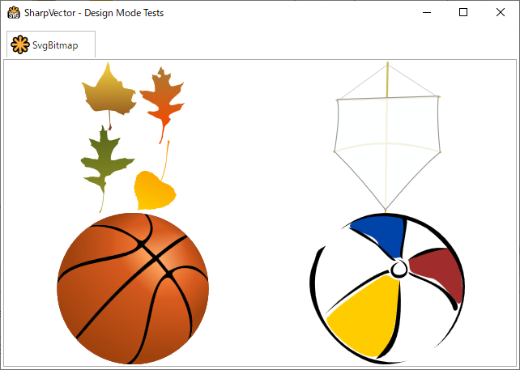
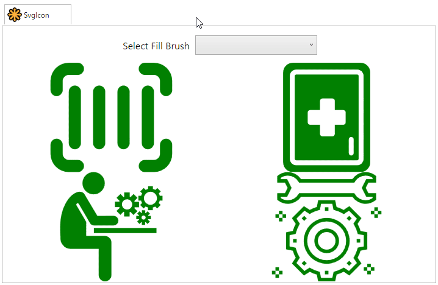

# SVG Image Controls

The image controls provide SVG-based static images for use in WPF applications by extending the [Image](xref:System.Windows.Controls.Image) control class. Currently, the following two controls are provided:

* [SvgBitmap](xref:SharpVectors.Converters.SvgBitmap), a basic SVG image control class.
* [SvgIcon](xref:SharpVectors.Converters.SvgIcon), a specialization of the basic SVG image control class to handle monochrome SVG images.

Currently, the rendering options or settings are not exposed through the properties of these control controls. However, this may change based on demand or user feedback. The class diagrams are shown below:

```mermaid
classDiagram
    class Image
    Image <|-- SvgBitmap
    SvgBitmap <|-- SvgIcon
    class SvgBitmap{
      +Uri UriSource
      +string SvgSource
      +string AppName
      #OnLoadDrawing(DrawingGroup) void
      #OnUnloadDiagram() void
      #GetDrawingSettings() WpfDrawingSettings
      #CreateDrawing() DrawingGroup
      #CreateDrawing(Uri, WpfDrawingSettings) DrawingGroup
      #CreateDrawing(string, WpfDrawingSettings) DrawingGroup
    }
    class SvgIcon{
      <<sealed>>
      +Brush Fill
      +Brush Stroke
      #OnLoadDrawing(DrawingGroup) void
      #OnUnloadDiagram() void
    }
```

## SvgBitmap Control

The [SvgBitmap](xref:SharpVectors.Converters.SvgBitmap) control extends the WPF [Image](xref:System.Windows.Controls.Image) control class, and provides the following additional properties:

* **SvgBitmap.UriSource** is used to set the [Uri](xref:System.Uri) of the SVG document to be converted to the image source.
* **SvgBitmap.SvgSource** is used to set the SVG document in plain text to be converted to the image source.
* **SvgBitmap.AppName** is used to specify the name of the source assembly in cases where the SVG document is a resource in a .NET assembly. This provides a hint to the system when resolving the URI to the resource file, especially in the design-mode.

The following is XAML code, from the **WpfTestResourceSvg** sample, illustrating how to use the **SvgBitmap** control.

```xml
<Window x:Class="WpfTestResourceSvg.MainWindow"
        xmlns="http://schemas.microsoft.com/winfx/2006/xaml/presentation"
        xmlns:x="http://schemas.microsoft.com/winfx/2006/xaml"
        xmlns:d="http://schemas.microsoft.com/expression/blend/2008"
        xmlns:mc="http://schemas.openxmlformats.org/markup-compatibility/2006"
        xmlns:svgc="http://sharpvectors.codeplex.com/svgc/"
        xmlns:local="clr-namespace:WpfTestResourceSvg"
        mc:Ignorable="d"
        Title="SharpVector - Design Mode Tests" Height="720" Width="960" Icon="App.ico" WindowStartupLocation="CenterScreen">
    <DockPanel LastChildFill="True" Margin="3">
        <TabControl>
            <TabItem x:Name="tabBitmap">
                <TabItem.Header>
                    <StackPanel Orientation="Horizontal">
                        <Image Height="24px" Width="24px" Source="{svgc:SvgImage Source=/Images/SvgLogoBasic.svg, AppName=WpfTestResourceSvg}" />
                        <TextBlock Text="SvgBitmap" Margin="3" VerticalAlignment="Center" MinWidth="70"/>
                    </StackPanel>
                </TabItem.Header>
                <UniformGrid Rows="2" Columns="2">
                    <svgc:SvgBitmap UriSource="/Resources/autum_leaf.svg"/>
                    <svgc:SvgBitmap UriSource="/Resources/kite.svg"/>
                    <svgc:SvgBitmap UriSource="/Resources/basket.svg"/>
                    <svgc:SvgBitmap UriSource="/Resources/beach_ball.svg"/>
                </UniformGrid>
            </TabItem>
        </TabControl>
    </DockPanel>
</Window>
```

The output of the above code is shown below:



## SvgIcon Control

The [SvgIcon](xref:SharpVectors.Converters.SvgIcon) control is a specialization of the [SvgBitmap](xref:SharpVectors.Converters.SvgBitmap) control for monochrome SVG documents, and provides the following additional properties:

* **SvgIcon.Fill** defines the [Uri](xref:System.Windows.Media.Brush) be used to fill any element that has a fill style.
* **SvgIcon.Stroke** defines the [Uri](xref:System.Windows.Media.Brush) be used to stroke any element that has a stroke style.

The brushes of the fill and/or stroke styles in the rendereded drawing are automatically bind to the above properties, so that any change in these properties will automatically change the corresponding element style.

> [!NOTE]
> Currently, we have not found any practical uses of the **SvgIcon.Stroke** property, but it is maintained per user request. The demonstration of the **SvgIcon.Fill** property is given below.

The following are XAML and C# codes, from the **WpfTestResourceSvg** sample, illustrating how to use the **SvgIcon** control.

# [XAML](#tab/xaml)
```csharp
<Window x:Class="WpfTestResourceSvg.MainWindow"
        xmlns="http://schemas.microsoft.com/winfx/2006/xaml/presentation"
        xmlns:x="http://schemas.microsoft.com/winfx/2006/xaml"
        xmlns:d="http://schemas.microsoft.com/expression/blend/2008"
        xmlns:mc="http://schemas.openxmlformats.org/markup-compatibility/2006"
        xmlns:svgc="http://sharpvectors.codeplex.com/svgc/"
        xmlns:local="clr-namespace:WpfTestResourceSvg"
        mc:Ignorable="d"
        Title="SharpVector - Design Mode Tests" Height="720" Width="960" Icon="App.ico" WindowStartupLocation="CenterScreen">
    <DockPanel LastChildFill="True" Margin="3">
            <TabItem x:Name="tabSvgIcon">
                <TabItem.Header>
                    <StackPanel Orientation="Horizontal">
                        <Image Height="24px" Width="24px" Source="{svgc:SvgImage Source=/Images/SvgLogoBasic.svg, AppName=WpfTestResourceSvg}" />
                        <TextBlock Text="SvgIcon" Margin="3" VerticalAlignment="Center" MinWidth="70"/>
                    </StackPanel>
                </TabItem.Header>
                <DockPanel LastChildFill="True">
                    <StackPanel Orientation="Horizontal" DockPanel.Dock="Top" Margin="10" HorizontalAlignment="Center">
                        <TextBlock Text="Select Fill Brush" FontSize="16" VerticalAlignment="Center" Margin="6"/>
                        <ComboBox x:Name="cboColors" ItemsSource="{Binding Path=KnownColors}" Margin="3" Height="32" 
                                  VerticalAlignment="Top" VerticalContentAlignment="Center" HorizontalAlignment="Left" 
                                  Width="200" BorderBrush="Transparent" SelectionChanged="OnColorChanged">
                            <ComboBox.ItemTemplate>
                                <DataTemplate>
                                    <StackPanel Orientation="Horizontal">
                                        <Border Width="32" Height="Auto" Margin="5,0" BorderThickness="1" BorderBrush="Black"  >
                                            <Border.Background>
                                                <SolidColorBrush Color="{Binding Color}"/>
                                            </Border.Background>
                                        </Border>
                                        <TextBlock Text="{Binding Name}" FontSize="12"/>
                                    </StackPanel>
                                </DataTemplate>
                            </ComboBox.ItemTemplate>
                        </ComboBox>
                    </StackPanel>
                <UniformGrid Rows="2" Columns="2">
                    <svgc:SvgIcon Fill="{Binding Path=FillBrush, FallbackValue=Gold}">
                        <svgc:SvgIcon.SvgSource>
                            <![CDATA[
<svg width="24" height="24" viewBox="0 0 24 24" fill="none" xmlns="http://www.w3.org/2000/svg">
  <path d="M2 6C2 4.34315 3.34315 3 5 3H6.5C7.05228 3 7.5 3.44772 7.5 4C7.5 4.55228 7.05228 5 6.5 5H5C4.44772 
  5 4 5.44772 4 6V7.5C4 8.05228 3.55228 8.5 3 8.5C2.44772 8.5 2 8.05228 2 7.5V6ZM16.5 4C16.5 3.44772 16.9477 
  3 17.5 3H19C20.6569 3 22 4.34315 22 6V7.5C22 8.05228 21.5523 8.5 21 8.5C20.4477 8.5 20 8.05228 20 7.5V6C20 
  5.44772 19.5523 5 19 5H17.5C16.9477 5 16.5 4.55228 16.5 4ZM3 15.5C3.55228 15.5 4 15.9477 4 16.5V18C4 18.5523 
  4.44772 19 5 19H6.5C7.05228 19 7.5 19.4477 7.5 20C7.5 20.5523 7.05228 21 6.5 21H5C3.34315 21 2 19.6569 2 18V16.5C2 
  15.9477 2.44772 15.5 3 15.5ZM21 15.5C21.5523 15.5 22 15.9477 22 16.5V18C22 19.6569 20.6569 21 19 21H17.5C16.9477 
  21 16.5 20.5523 16.5 20C16.5 19.4477 16.9477 19 17.5 19H19C19.5523 19 20 18.5523 20 18V16.5C20 15.9477 20.4477 
  15.5 21 15.5ZM6 6.75C6.55228 6.75 7 7.19772 7 7.75V16.25C7 16.8023 6.55228 17.25 6 17.25C5.44772 17.25 5 16.8023 
  5 16.25V7.75C5 7.19772 5.44772 6.75 6 6.75ZM11 7.75C11 7.19772 10.5523 6.75 10 6.75C9.44772 6.75 9 7.19772 9 
  7.75V16.25C9 16.8023 9.44772 17.25 10 17.25C10.5523 17.25 11 16.8023 11 16.25V7.75ZM14 6.75C14.5523 6.75 15 7.19772 
  15 7.75V16.25C15 16.8023 14.5523 17.25 14 17.25C13.4477 17.25 13 16.8023 13 16.25V7.75C13 7.19772 13.4477 6.75 
  14 6.75ZM19 7.75C19 7.19772 18.5523 6.75 18 6.75C17.4477 6.75 17 7.19772 17 7.75V16.25C17 16.8023 17.4477 17.25 
  18 17.25C18.5523 17.25 19 16.8023 19 16.25V7.75Z" fill="#212121" />
</svg>                            ]]>
                        </svgc:SvgIcon.SvgSource>
                    </svgc:SvgIcon>
                    <svgc:SvgIcon Fill="{Binding Path=FillBrush, FallbackValue=Red}">
                        <svgc:SvgIcon.SvgSource>
                            <![CDATA[
<svg version="1.1" id="Capa_1" xmlns="http://www.w3.org/2000/svg" xmlns:xlink="http://www.w3.org/1999/xlink" x="0px" y="0px"
     viewBox="0 0 221.692 221.692" style="enable-background:new 0 0 221.692 221.692;" xml:space="preserve">
<path d="M179.339,0H42.353C31.521,0,22.708,8.813,22.708,19.645v182.403c0,10.832,8.813,19.645,19.645,19.645h136.987
    c10.833,0,19.645-8.813,19.645-19.645V19.645C198.984,8.813,190.172,0,179.339,0z M185.513,195.125
    c0,7.015-5.707,12.722-12.721,12.722H48.901c-7.015,0-12.721-5.707-12.721-12.722V26.567c0-7.015,5.707-12.721,12.721-12.721
    h123.891c7.015,0,12.721,5.706,12.721,12.721V195.125z M172.792,23.847H48.901c-1.5,0-2.721,1.221-2.721,2.721v168.558
    c0,1.501,1.221,2.722,2.721,2.722h123.891c1.5,0,2.721-1.221,2.721-2.722V26.567C175.513,25.067,174.292,23.847,172.792,23.847z
     M149.293,120.847c0,2.762-2.239,5-5,5h-17v18.446c0,2.762-2.239,5-5,5h-20c-2.761,0-5-2.238-5-5v-18.446H77.399
    c-2.761,0-5-2.238-5-5v-20c0-2.762,2.239-5,5-5h19.895V77.399c0-2.762,2.239-5,5-5h20c2.761,0,5,2.238,5,5v18.447h17
    c2.761,0,5,2.238,5,5V120.847z M165.521,183.125c0,2.762-2.239,5-5,5s-5-2.238-5-5v-27.667c0-2.762,2.239-5,5-5s5,2.238,5,5V183.125
    z"/>
</svg>                            
                            ]]>
                        </svgc:SvgIcon.SvgSource>
                    </svgc:SvgIcon>
                    <svgc:SvgIcon Fill="{Binding Path=FillBrush, FallbackValue=Blue}">
                        <svgc:SvgIcon.SvgSource>
                            <![CDATA[
<svg version="1.2" baseProfile="tiny" id="Layer_1" xmlns="http://www.w3.org/2000/svg" xmlns:xlink="http://www.w3.org/1999/xlink"
     x="0px" y="0px" viewBox="-63 65 128 128" xml:space="preserve">
<g>
    <rect x="-16.9" y="130.3" width="71.8" height="5.8"/>
    <circle cx="-17.2" cy="78.8" r="12.8"/>
    <path d="M1,141.7c-1.5-1.5-3.3-2.3-5.1-2.3h-21.6v-16.1l-11.2-19.1c-0.4-0.7-0.1-1.8,0.5-2.2c0.7-0.4,1.8-0.1,2.2,0.5l12.8,22.1
        c0.9,1.7,2.7,2.8,4.8,2.8H5.6c3.1,0,5.6-2.6,5.6-5.6c0-3.1-2.6-5.6-5.6-5.6l-18.5,0.2l-14.7-24.8c-1-2-3.2-3-5.8-3
        c-0.3,0-1.1,0.1-1.6,0.2c-0.3,0.1-0.8,0.2-1.1,0.3c-10.8,3.5-19.4,20.6-19.4,38.3c-0.1,5.3,0,9.8,0.3,14.1
        c-0.4,5.1,2.6,10.1,7.6,12c1.4,0.4,2.6,0.7,4,0.7h32.2v30.1c0,4.2,3.2,7.3,7.3,7.3c4.2,0,7.3-3.2,7.3-7.3v-37.5
        C3.2,145,2.5,143,1,141.7z"/>
    <path d="M61.8,98.9v-5.6h-3.1c-0.2-1-0.6-2-1.1-2.8l2.2-2.2l-4-4l-2.2,2.2c-0.9-0.5-1.9-0.9-2.8-1.1v-3.1h-5.5v3.1
        c-1,0.2-2,0.6-2.8,1.1l-2.2-2.2l-4,4l2.1,2.2c-0.5,0.9-0.9,1.9-1.1,2.8h-3.1v5.5h3.1c0.2,1,0.6,2,1.1,2.8l-2.2,2.2l4,4l2.2-2.2
        c0.9,0.5,1.9,0.9,2.8,1.1v3.1h5.5v-3.1c1-0.2,2-0.6,2.8-1.1l2.2,2.2l4-4l-2.2-2.2c0.5-0.9,0.9-1.9,1.1-2.8h3.2V98.9z M48,103.6
        c-4.2,0-7.5-3.3-7.5-7.5s3.3-7.5,7.5-7.5s7.5,3.3,7.5,7.5C55.4,100.2,52,103.6,48,103.6z"/>
    <path d="M38.2,109.8v3c-0.1,0-0.2,0.1-0.4,0.2c-0.1,0-0.2,0.1-0.2,0.1l-2.1-2.1l-2.7,2.7l2.1,2.1c-0.1,0.2-0.2,0.4-0.2,0.6h-3v3.8
        h3c0.1,0.2,0.2,0.4,0.2,0.5l-2.2,2.2l2.7,2.7l2.2-2.2c0.2,0.1,0.3,0.1,0.5,0.2v3.1h3.8v-3.1c0.1,0,0.2-0.1,0.3-0.1
        c0.1,0,0.1,0,0.2-0.1l2.2,2.2l2.7-2.7l-2.2-2.2c0.1-0.2,0.2-0.3,0.2-0.5h3.1v-3.8h-3c-0.1-0.2-0.1-0.4-0.2-0.5l2.2-2.1l-2.7-2.7
        l-2.1,2.1c-0.2-0.1-0.4-0.2-0.6-0.2v-3L38.2,109.8z M42.1,119.4c-0.6,1.1-2.1,1.6-3.2,0.9c-1.1-0.6-1.6-2.1-0.9-3.2
        c0.6-1.1,2.1-1.6,3.2-0.9C42.4,116.8,42.9,118.3,42.1,119.4z"/>
    <path d="M12.7,107.1l-3.6,3.6l4.4,4.5l3.6-3.6c0.2,0.1,0.3,0.1,0.4,0.2c0.1,0,0.2,0.1,0.3,0.1v5.2h6.3V112c0.3-0.1,0.5-0.2,0.8-0.3
        l3.6,3.6l4.5-4.4l-3.5-3.5c0.1-0.3,0.3-0.6,0.4-0.9h5v-6.3h-5c-0.1-0.3-0.2-0.6-0.4-0.9l3.6-3.6l-4.4-4.5l-3.5,3.5
        c-0.2-0.1-0.4-0.2-0.6-0.2c-0.1,0-0.2-0.1-0.4-0.2v-4.9h-6.3v4.9c-0.3,0.1-0.6,0.2-0.9,0.4l-3.4-3.5l-4.5,4.4l3.5,3.5
        c-0.1,0.3-0.3,0.6-0.4,0.9h-5v6.3h5.1C12.4,106.6,12.5,106.9,12.7,107.1z M19.6,97.4c3.1-0.8,6.5,1,7.3,4.2c0.8,3.1-1,6.5-4.2,7.3
        c-3.1,0.8-6.5-1-7.3-4.2C14.5,101.6,16.4,98.3,19.6,97.4z"/>
</g>
</svg>                            
                            ]]>
                        </svgc:SvgIcon.SvgSource>
                    </svgc:SvgIcon>
                        <svgc:SvgIcon Fill="{Binding Path=FillBrush, FallbackValue=Magenta}">
                        <svgc:SvgIcon.SvgSource>
                            <![CDATA[
<svg width="64px" height="64px" viewBox="0 0 64 64" style="enable-background:new 0 0 64 64;" 
    version="1.1" xml:space="preserve" xmlns="http://www.w3.org/2000/svg" xmlns:xlink="http://www.w3.org/1999/xlink">
  <g>
    <path d="M51.186,45.583L55,44.82v-9.64l-3.814-0.763c-0.408-1.406-0.968-2.759-1.671-4.038l2.157-3.235l-6.817-6.816l-3.235,2.157   
    c-1.277-0.703-2.631-1.263-4.037-1.671L36.82,17H27.18l-0.762,3.814c-1.395,0.405-2.737,0.958-4.004,1.652l-3.275-2.131   
    l-6.804,6.803l2.131,3.277c-0.688,1.256-1.237,2.585-1.641,3.965L9,35.189v9.621l3.825,0.81c0.403,1.38,0.953,2.709,1.641,3.965   
    l-2.131,3.277l6.804,6.803l3.275-2.131c1.256,0.687,2.585,1.237,3.965,1.641L27.189,63h9.621l0.811-3.825   
    c1.392-0.407,2.732-0.964,3.998-1.66l3.235,2.157l6.817-6.816l-2.157-3.235C50.218,48.342,50.777,46.988,51.186,45.583z    
    M49.098,52.601l-4.497,4.498l-2.909-1.939l-0.541,0.321c-1.442,0.854-3.001,1.502-4.633,1.925l-0.599,0.155L35.189,61h-6.379   
    l-0.729-3.44l-0.599-0.155c-1.618-0.419-3.164-1.059-4.596-1.902l-0.534-0.314l-2.946,1.916l-4.511-4.511l1.916-2.947l-0.314-0.534   
    c-0.843-1.431-1.482-2.977-1.901-4.595l-0.154-0.6L11,43.189v-6.379l3.441-0.729l0.154-0.6c0.419-1.618,1.059-3.164,1.901-4.595   
    l0.314-0.534l-1.916-2.947l4.511-4.511l2.946,1.916l0.534-0.314c1.443-0.851,3.004-1.494,4.639-1.913l0.609-0.156L28.82,19h6.359   
    l0.686,3.428l0.609,0.156c1.647,0.422,3.221,1.073,4.676,1.936l0.541,0.321l2.909-1.939l4.497,4.498l-1.938,2.909l0.32,0.541   
    c0.862,1.456,1.514,3.029,1.936,4.676l0.156,0.609L53,36.82v6.36l-3.429,0.686l-0.156,0.609c-0.422,1.647-1.073,3.22-1.936,4.676   
    l-0.32,0.541L49.098,52.601z" />
    <rect height="2" width="2" x="31" y="21" />
    <rect height="2" transform="matrix(0.7071 -0.7071 0.7071 0.7071 -13.6394 21.6155)" width="2" x="18.273" y="26.272" />
    <rect height="2" width="2" x="13" y="39" />
    <rect height="2" transform="matrix(0.7071 -0.7071 0.7071 0.7071 -31.6396 29.0714)" width="2" x="18.273" y="51.728" />
    <rect height="2" width="2" x="31" y="57" />
    <rect height="2" transform="matrix(0.7071 -0.7071 0.7071 0.7071 -24.184 47.0708)" width="2" x="43.728" y="51.728" />
    <rect height="2" width="2" x="49" y="39" />
    <rect height="2" transform="matrix(0.7071 -0.7071 0.7071 0.7071 -6.1838 39.6149)" width="2" x="43.728" y="26.272" />
    <path d="M32,27c-7.168,0-13,5.832-13,13s5.832,13,13,13s13-5.832,13-13S39.168,27,32,27z M32,51c-6.065,0-11-4.935-11-11   s4.935-11,11-11s11,4.935,11,11S38.065,51,32,51z" />
    <path d="M32,33c-3.859,0-7,3.14-7,7s3.141,7,7,7s7-3.14,7-7S35.859,33,32,33z M32,45c-2.757,0-5-2.243-5-5s2.243-5,5-5s5,2.243,5,5   S34.757,45,32,45z" />
    <rect height="2" width="2" x="55" y="53" />
    <rect height="2" width="2" x="55" y="57" />
    <rect height="2" width="2" x="57" y="55" />
    <rect height="2" width="2" x="53" y="55" />
    <rect height="2" width="2" x="3" y="55" />
    <rect height="2" width="2" x="3" y="59" />
    <rect height="2" width="2" x="5" y="57" />
    <rect height="2" width="2" x="1" y="57" />
    <rect height="2" width="2" x="59" y="21" />
    <rect height="2" width="2" x="59" y="25" />
    <rect height="2" width="2" x="61" y="23" />
    <rect height="2" width="2" x="57" y="23" />
    <rect height="2" width="2" x="5" y="23" />
    <rect height="2" width="2" x="5" y="27" />
    <rect height="2" width="2" x="7" y="25" />
    <rect height="2" width="2" x="3" y="25" />
    <path d="M10,19c2.999,0,5.812-1.519,7.475-4h29.051c1.663,2.481,4.476,4,7.475,4c2.064,0,4.011-0.689,5.628-1.992l0.372-0.3V13   
    h-4.382l-1.5-3l1.5-3H60V3.292l-0.372-0.3C58.011,1.689,56.064,1,54,1c-2.999,0-5.812,1.519-7.475,4H17.475   
    C15.812,2.519,12.999,1,10,1C7.936,1,5.989,1.689,4.372,2.992L4,3.292V7h4.382l1.5,3l-1.5,3H4v3.708l0.372,0.3   
    C5.989,18.311,7.936,19,10,19z M6,15h3.618l2.5-5l-2.5-5H6V4.268C7.179,3.437,8.552,3,10,3c2.484,0,4.805,1.342,6.056,3.501   
    L16.345,7h31.311l0.289-0.499C49.195,4.342,51.516,3,54,3c1.448,0,2.821,0.437,4,1.268V5h-3.618l-2.5,5l2.5,5H58v0.732   
    C56.821,16.563,55.448,17,54,17c-2.484,0-4.805-1.342-6.056-3.501L47.655,13H16.345l-0.289,0.499C14.805,15.658,12.484,17,10,17   
    c-1.448,0-2.821-0.437-4-1.268V15z" />
  </g>
</svg>                            
                            ]]>
                        </svgc:SvgIcon.SvgSource>
                    </svgc:SvgIcon>
                </UniformGrid>
                </DockPanel>
            </TabItem>
        </TabControl>
    </DockPanel>
</Window>
```

# [C#](#tab/csharp)
```csharp
using System;
using System.Collections.Generic;
using System.Linq;
using System.Reflection;
using System.ComponentModel;

using System.Windows;
using System.Windows.Controls;
using System.Windows.Media;

namespace WpfTestResourceSvg
{
    /// <summary>
    /// Interaction logic for MainWindow.xaml
    /// </summary>
    public partial class MainWindow : Window, INotifyPropertyChanged
    {
        public class KnownColor
        {
            public Color Color { get; set; }
            public string Name { get; set; }
        }

        private Brush _fillBrush;

        private IList<KnownColor> _knownColors;

        public event PropertyChangedEventHandler PropertyChanged;

        public MainWindow()
        {
            InitializeComponent();

            _fillBrush = Brushes.Green;
            _knownColors = typeof(Colors).GetProperties(BindingFlags.Public | BindingFlags.Static)
                .Select(i => new KnownColor()
                {
                    Color = (Color)i.GetValue(null, null),
                    Name = i.Name
                }).ToList();

            this.DataContext = this;
        }

        public Brush FillBrush
        {
            get {
                return _fillBrush;
            }
        }

        public IList<KnownColor> KnownColors
        {
            get {
                return _knownColors;
            }
        }

        private void OnColorChanged(object sender, SelectionChangedEventArgs e)
        {
            if (cboColors.SelectedIndex < 0)
            {
                return;
            }

            _fillBrush = new SolidColorBrush(_knownColors[cboColors.SelectedIndex].Color);
            this.NotifyPropertyChanged("FillBrush");
        }

        private void NotifyPropertyChanged(string propertyName)
        {
            PropertyChanged?.Invoke(this, new PropertyChangedEventArgs(propertyName));
        }
    }
}
```
***

The output of the above codes is shown below:


