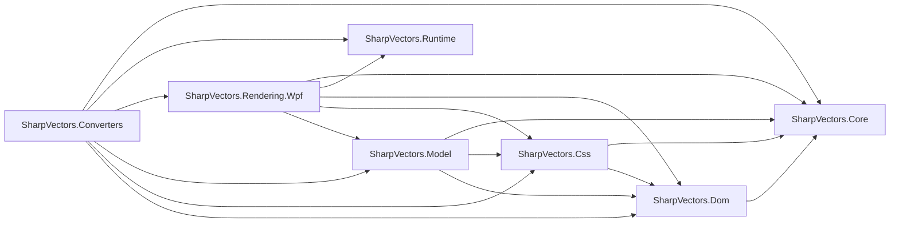
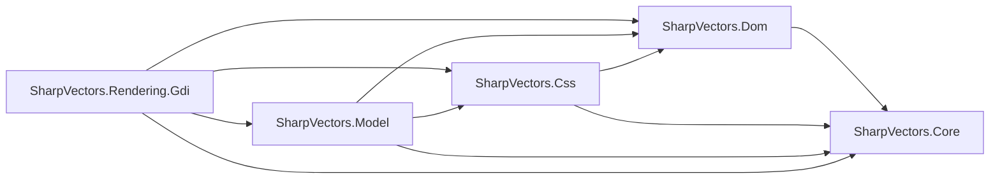

# Overview
The SharpVectors is packaged in several .NET assemblies. Here is the complete list of available assemblies to get you started on developing and using the library.

* **SharpVectors.Core**: This the core library defining all the required interfaces in the W3C SVG specifications, including the events and the style sheets interfaces. There is no official W3C interfaces defined for the .NET framework (like the Java, JavaScript and IDL interfaces), therefore the interfaces defined in this component are .NET specific, and not compactible in naming standards to the W3C interfaces.
* **SharpVectors.Dom**: This is an extension to the .NET Framework implementation of the XML DOM ([XmlDocument](xref:System.Xml.XmlDocument)) to support the SVG. The .NET [XmlDocument](xref:System.Xml.XmlDocument) class is extended to support the SVG interfaces defined in the `SharpVectors.Core`.
* **SharpVectors.Css**: This is the implmentation of the style sheets interfaces defined in the `SharpVectors.Core`, and it is implemented as an extension to the XML DOM of the .NET framework.
* **SharpVectors.Model**: This is the main implementation of the SVG DOM and interfaces. In includes the parser of the SVG documents, reducing the SVG file or stream to memory model of .NET objects. Note that this and the above assemblies do not depend on the GDI+ or WPF graphical primitives or objects.
* **SharpVectors.Runtime.Wpf**: This is an optional **WPF** library providing SVG object specific information at the runtime. This includes conversion classes to handle **GlyphTypeface.FontUri**, which will otherwise be hard-coded with the full path information that may not work on the user's machine, classes to handle embedded images etc.
* **SharpVectors.Rendering.Wpf**: This is **WPF** library, which handles the rendering of the SVG object to the WPF drawing objects.
* **SharpVectors.Converters.Wpf**: This is **WPF** library, which uses the **SharpVectors.Rendering.Wpf** library to perform actual conversion for viewing.
* **SharpVectors.Rendering.Gdi**: This is **GDI+** library, which handles the rendering of the SVG object to the System.Drawing objects. This is less complete compared with the WPF renderer.

For the **WPF** components or assemblies, the dependencies are shown in the diagram below:

For the **GDI+** components or assemblies, the dependencies are shown in the diagram below:

## History
We believe understanding the beginning of this library or its initial goals will make it easy to understand why some features are implemented as it is currently.
* Years ago, Adobe decided to retired the only the most reliable SVG plugin for the Internet Explorer 6+.
* With no clear plans to implement native SVG support in browsers, a company using these features to create an interactive car wiring manual for repairing shops, decided to evaluate other options.
* With only one month to evaluate and present the options, we decided on WPF to take advantage of its flowdocument and animation features, combined with **ClickOnce** deployments.
* We needed to convert the SVG diagrams, but the only commercial option available was not rendering valid outputs, no options for user-defined fonts and it was obfuscated - it cannot be extended for our customized needs.
* Looking for a better solution, we decided to add WPF support to the abandoned SVG library [SharpVectorGraphics (aka SVG#)](https://sourceforge.net/projects/svgdomcsharp/).
* We removed the scripting features (based on depreciated library), and separated the rendering component from the parsing component.

Now, since the shipped product will dynamically load the flowdocuments with the coverted SVG diagrams in XAML format:
* We provided an independent **SharpVectors.Runtime.Wpf** for viewing the XAML diagrams in the client environment.
* We also provided @SharpVectors.Runtime.SvgDrawingCanvas to display the diagrams, @SharpVectors.Runtime.SvgAnimator and @SharpVectors.Runtime.SvgAnimationLayer (now modified) for animation.
* We created the **ZAML** format, a G-zip compression of the  **XAML** files just like the  **SVGZ** files, to reduce the download size and improve speed.

Well, we were disappointed with the results of the evaluation, the speed of `WPF 3.5` on the expected basic specs PC in the repair shops, could not match the `HTML/SVG` rendering speed in the browsers.
We released the updated library on `CodePlex` for other developers to use - the effort could not be wasted! With the quick adoption by the community, some of the design flaws stayed to avoid breaking changes. 

* The **SharpVectors.Converters.Wpf** library was later added due to increased demand for specialized converters and controls.

In the Version 2.0, we will finally make some breaking changes, including
* The **SharpVectors.Converters.Wpf**, **SharpVectors.Runtime.Wpf** and **SharpVectors.Rendering.Wpf** will be combined.
* **SharpVectors.Runtime.Wpf** namespace will be removed.
* .NET 4.0 (and maybe .NET 4.5) supports will be dropped. It makes no sense, since there is no feature change in WPF, but we can take advantage of C# improvements.

## Further Information

For further information, click the documentation links below:
* **[Getting Started](xref:topic_getting_started)**
	* [SVG Converters](xref:topic_converters)
	* [SVG Type Converters or Markup Extensions](xref:topic_markup_extensions)
	* [SVG Controls and Viewers](xref:topic_controls)
* **[Samples and Test Applications](xref:topic_samples)**
	* [WPF Test Sample](xref:topic_samples)
	* [WPF W3C Test Suite](xref:topic_samples)
	* [GDI+ Control Test Sample](xref:topic_samples)
	* [GDI+ Test Viewer Sample](xref:topic_samples)
* **[Applications](xref:topic_applications)**