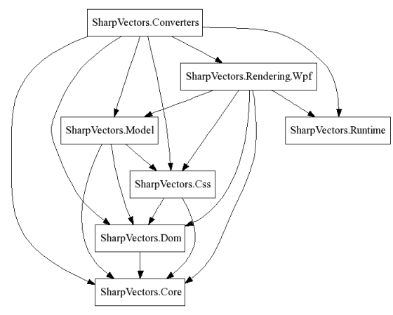
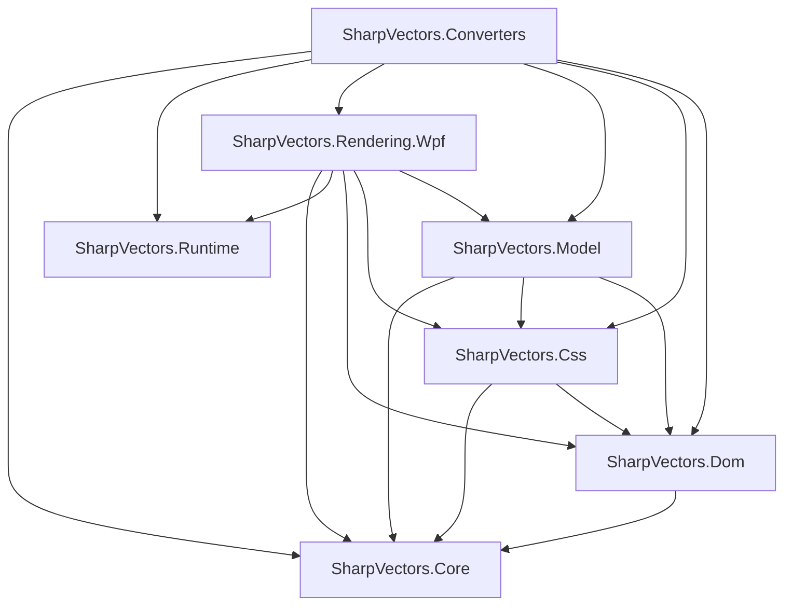
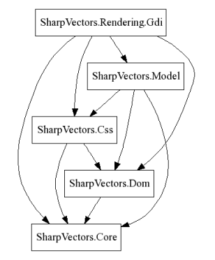

## Overview
The SharpVectors is packaged in several .NET assemblies. Here is the complete list of available assemblies to get you started on developing and using the library.

* **SharpVectors.Core**: This the core library defining all the required interfaces as defined by the W3C SVG specifications, including the events and the style sheets interfaces. 
* **SharpVectors.Dom**: This is an extension to the .NET Framework implementation of the XML DOM (XmlDocument) to support the SVG.
* **SharpVectors.Css**: This is an extension to the .NET Framework DOM to support style sheets interfaces.
* **SharpVectors.Model**: This is the main implementation of the SVG DOM and interfaces. This is the parser of the SVG documents, reducing the SVG file to memory model of .NET objects. This and the above assemblies do not depend on GDI+ or the WPF libraries.
* **SharpVectors.Runtime.Wpf**: This is an optional **WPF** library providing SVG object specific information at the runtime. This includes conversion classes to handle **GlyphTypeface.FontUri**, which will otherwise be hard-coded with the full path information that may not work on the user's machine, classes to handle embedded images etc.
* **SharpVectors.Rendering.Wpf**: This is **WPF** library, which handles the rendering of the SVG object to the WPF drawing objects.
* **SharpVectors.Converters.Wpf**: This is **WPF** library, which uses the **SharpVectors.Rendering.Wpf** library to perform actual conversion for viewing.
* **SharpVectors.Rendering.Gdi**: This is **GDI+** library, which handles the rendering of the SVG object to the System.Drawing objects. This is less complete compared with the WPF renderer. This is not shown in the above diagram. Its dependency diagram is shown below. 

For further information, click the documentation links below:
* **[Getting Started](xref:topic_getting_started)**
	* [Usage: Converters](xref:topic_converters)
	* [Usage: Type Converters](xref:topic_markup_extensions)
	* [Usage: Controls and Viewers](xref:topic_controls)
* **[Samples and Test Applications](Samples.md)**
	* [WPF Test Sample](Samples.md#WpfTestSvgSample)
	* [WPF W3C Test Suite](Samples.md#WpfW3cSvgTestSuite)
	* [GDI+ Control Test Sample](Samples.md#GdiTestSvgControl)
	* [GDI+ Test Viewer Sample](Samples.md#GdiTestSvgViewer)
* **[Applications](Applications.md)**