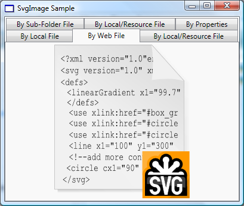

# SVG Markup Extensions
The SVG# Reloaded comes with one main end-user application, an SVG Viewer or Browser. The viewer is named Squiggle.NET or simply Squiggle, after a similar viewer in the [Batik SVG Toolkit](http://xmlgraphics.apache.org/batik/) (since the target is to produce something similar to the [Batik Squiggle](http://xmlgraphics.apache.org/batik/tools/browser.html)).


## WPF Extensions and Type Converters
These are WPF markup extensions or type converters for handling the SVG files in WPF applications.
Currently, the SVG# Reloaded provides one markup extension, **SvgImageExtension**, which converts an SVG source file to a [DrawingImage](https://docs.microsoft.com/en-us/dotnet/api/system.windows.media.drawingimage).


* As shown in the diagram above, all the rendering settings are available on this markup extension as properties.
* The main property here is the **SvgImageExtension.Source**, which is the path to the SVG file, and the file itself can be located in the following:
	* **Web/Internet**: The path in this case is the HTTP, FTP, etc scheme URI of the file.
	* **Local Computer Disk**: The path is the absolute or the relative URI to the SVG file.
	* **Resources**: The path is the [Microsoft Pack URI](https://docs.microsoft.com/en-us/dotnet/framework/wpf/app-development/pack-uris-in-wpf) of the SVG resource file.

For the illustration, we will create a simple WPF Application shown below, each image displayed is an SVG file in the WPF [Image Control](https://docs.microsoft.com/en-us/dotnet/api/system.windows.controls.image):



1. Create a .NET 3.5 WPF Application in C# or VB.NET, we will name it **SvgImageSample** and rename the main Window, **MainWindow**.
2. As above, add the following SVG# Reloaded assemblies
	* SharpVectors.Converters.Wpf.dll
	* SharpVectors.Core.dll
	* SharpVectors.Css.dll
	* SharpVectors.Dom.dll
	* SharpVectors.Model.dll
	* SharpVectors.Rendering.Wpf.dll
	* SharpVectors.Runtime.Wpf.dll
3. Modify the generated XAML code to the following (the C# or VB.NET codes are not modified):
	```xml
	<Window x:Class="SvgImageSample.MainWindow"
	    xmlns="http://schemas.microsoft.com/winfx/2006/xaml/presentation"
	    xmlns:x="http://schemas.microsoft.com/winfx/2006/xaml"
	    xmlns:svgc="http://sharpvectors.codeplex.com/svgc/"
	    xmlns:sys="clr-namespace:System;assembly=mscorlib"
	    Title="SvgImage Sample" Height="346" Width="409" Background="White">
	    <Window.Resources>
		<ResourceDictionary> 
		    <sys:String x:Key="WebFile">
			http://upload.wikimedia.org/wikipedia/commons/c/c7/SVG.svg
		    </sys:String>
		</ResourceDictionary>
	    </Window.Resources>
	    <DockPanel>
		<TabControl SelectedIndex="0" OverridesDefaultStyle="False">
		    <TabItem>
			<TabItem.Header>By Local File</TabItem.Header>
			<TabItem.Content>  
			    <!-- 1. Load local SVG file, using the constructor -->
			    <Image Source="{svgc:SvgImage ../Test1.svg}"/>        
			</TabItem.Content>
		    </TabItem>
		    <TabItem>
			<TabItem.Header>By Web File</TabItem.Header>
			<TabItem.Content>    
			    <!-- 2. Load Web SVG file, using the constructor. -->
			    <Image Source="{svgc:SvgImage {StaticResource WebFile}}"/>
			</TabItem.Content>
		    </TabItem>
		    <TabItem>
			<TabItem.Header>By Local/Resource File</TabItem.Header>
			<TabItem.Content>
			    <!-- 3. Load local, using the constructor and a property. -->
			    <Image Source="{svgc:SvgImage Test2.svg, TextAsGeometry=True}"/>
			</TabItem.Content>
		    </TabItem>
		    <TabItem>
			<TabItem.Header>By Sub-Folder File</TabItem.Header>
			<TabItem.Content>
			    <!-- 4. Load local, using constructor - works, but not 
			     recommended syntax, simply use /SubFolder/Test3.svg  -->
			    <Image Source="{svgc:SvgImage \\SubFolder\\Test3.svg}"/>
			</TabItem.Content>
		    </TabItem>
		    <TabItem>
			<TabItem.Header>By Local/Resource File</TabItem.Header>
			<TabItem.Content>
			    <!-- 5. Load resource, using the constructor. -->
			    <Image Source="{svgc:SvgImage /Resources/Test.svg}"/>
			</TabItem.Content>
		    </TabItem>
		    <TabItem>
			<TabItem.Header>By Properties</TabItem.Header>
			<TabItem.Content>
			    <!-- 6. Load resource, using property. -->
			    <Image Source="{svgc:SvgImage Source=/Resources/Test.svg}"/>
			</TabItem.Content>
		    </TabItem>
		</TabControl>
	    </DockPanel>
	</Window>
	```
	**NOTE**: As shown above, the local relative path and resource path are similar, and in this case the local directory is searched at runtime, and if no such file is found, it is assumed to be in the resource.
4. Compile and run the program. 

